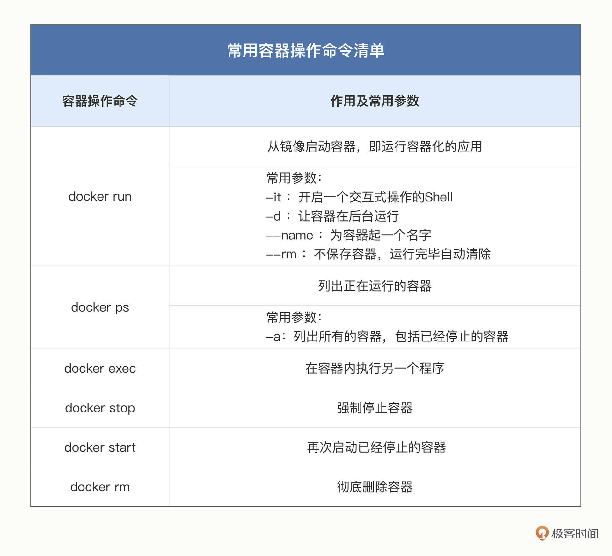
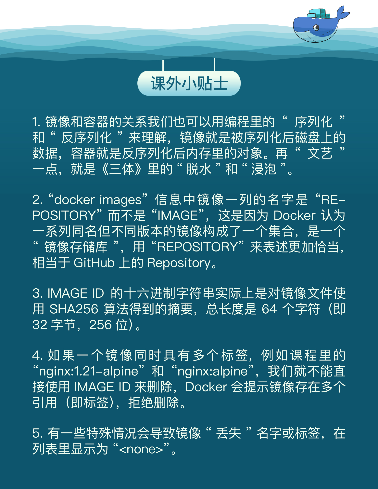

你好，我是Chrono。

在上一次课里，我们了解了容器技术中最核心的概念：容器，知道它就是一个系统中被隔离的特殊环境，进程可以在其中不受干扰地运行。我们也可以把这段描述再简化一点：**容器就是被隔离的进程**。

相比笨重的虚拟机，容器有许多优点，那我们应该如何创建并运行容器呢？是要用Linux内核里的namespace、cgroup、chroot三件套吗？

当然不会，那样的方式实在是太原始了，所以今天，我们就以Docker为例，来看看什么是容器化的应用，怎么来操纵容器化的应用。

## 什么是容器化的应用

之前我们运行容器的时候，显然不是从零开始的，而是要先拉取一个“镜像”（image），再从这个“镜像”来启动容器，像\[第一节课\]这样：

```bash
docker pull busybox docker run busybox echo hello world
```

那么，这个“镜像”到底是什么东西呢？它又和“容器”有什么关系呢？

其实我们在其他场合中也曾经见到过“镜像”这个词，比如最常见的光盘镜像，重装电脑时使用的硬盘镜像，还有虚拟机系统镜像。这些“镜像”都有一些相同点：只读，不允许修改，以标准格式存储了一系列的文件，然后在需要的时候再从中提取出数据运行起来。

容器技术里的镜像也是同样的道理。因为容器是由操作系统动态创建的，那么必然就可以用一种办法把它的初始环境给固化下来，保存成一个静态的文件，相当于是把容器给“拍扁”了，这样就可以非常方便地存放、传输、版本化管理了。


如果还拿之前的“小板房”来做比喻的话，那么镜像就可以说是一个“样板间”，把运行进程所需要的文件系统、依赖库、环境变量、启动参数等所有信息打包整合到了一起。之后镜像文件无论放在哪里，操作系统都能根据这个“样板间”快速重建容器，应用程序看到的就会是一致的运行环境了。

从功能上来看，镜像和常见的tar、rpm、deb等安装包一样，都打包了应用程序，**但最大的不同点在于它里面不仅有基本的可执行文件，还有应用运行时的整个系统环境。这就让镜像具有了非常好的跨平台便携性和兼容性**，能够让开发者在一个系统上开发（例如Ubuntu），然后打包成镜像，再去另一个系统上运行（例如CentOS），完全不需要考虑环境依赖的问题，是一种更高级的应用打包方式。

理解了这一点，我们再回过头来看看第一节课里运行的Docker命令。

`docker pull busybox` ，就是获取了一个打包了busybox应用的镜像，里面固化了busybox程序和它所需的完整运行环境。

`docker run busybox echo hello world` ，就是提取镜像里的各种信息，运用namespace、cgroup、chroot技术创建出隔离环境，然后再运行busybox的 `echo` 命令，输出 `hello world` 的字符串。

这两个步骤，由于是基于标准的Linux系统调用和只读的镜像文件，所以，无论是在哪种操作系统上，或者是使用哪种容器实现技术，都会得到完全一致的结果。

推而广之，任何应用都能够用这种形式打包再分发后运行，这也是无数开发者梦寐以求的“一次编写，到处运行（Build once, Run anywhere）”的至高境界。所以，**所谓的“容器化的应用”，或者“应用的容器化”，就是指应用程序不再直接和操作系统打交道，而是封装成镜像，再交给容器环境去运行**。

现在你就应该知道了，镜像就是静态的应用容器，容器就是动态的应用镜像，两者互相依存，互相转化，密不可分。

之前的那张Docker官方架构图你还有印象吧，我们在第一节课曾经简单地介绍过。可以看到，在Docker里的核心处理对象就是镜像（image）和容器（container）：


好，理解了什么是容器化的应用，接下来我们再来学习怎么操纵容器化的应用。因为镜像是容器运行的根本，先有镜像才有容器，所以先来看看关于镜像的一些常用命令。

## 常用的镜像操作有哪些

在前面的课程里你应该已经了解了两个基本命令，`docker pull` 从远端仓库拉取镜像，`docker images` 列出当前本地已有的镜像。

`docker pull` 的用法还是比较简单的，和普通的下载非常像，不过我们需要知道镜像的命名规则，这样才能准确地获取到我们想要的容器镜像。

**镜像的完整名字由两个部分组成，名字和标签，中间用 `:` 连接起来。**

名字表明了应用的身份，比如busybox、Alpine、Nginx、Redis等等。标签（tag）则可以理解成是为了区分不同版本的应用而做的额外标记，任何字符串都可以，比如3.15是纯数字的版本号、jammy是项目代号、1.21-alpine是版本号加操作系统名等等。其中有一个比较特殊的标签叫“latest”，它是默认的标签，如果只提供名字没有附带标签，那么就会使用这个默认的“latest”标签。

那么现在，你就可以把名字和标签组合起来，使用 `docker pull` 来拉取一些镜像了：

```undefined
docker pull alpine:3.15 docker pull ubuntu:jammy docker pull nginx:1.21-alpine docker pull nginx:alpine docker pull redis
```

有了这些镜像之后，我们再用 `docker images` 命令来看看它们的具体信息：


在这个列表里，你可以看到，REPOSITORY列就是镜像的名字，TAG就是这个镜像的标签，那么第三列“IMAGE ID”又是什么意思呢？

它可以说是镜像唯一的标识，就好像是身份证号一样。比如这里我们可以用“ubuntu:jammy”来表示Ubuntu 22.04镜像，同样也可以用它的ID“d4c2c……”来表示。

另外，你可能还会注意到，截图里的两个镜像“nginx:1.21-alpine”和“nginx:alpine”的IMAGE ID是一样的，都是“a63aa……”。这其实也很好理解，这就像是人的身份证号码是唯一的，但可以有大名、小名、昵称、绰号，同一个镜像也可以打上不同的标签，这样应用在不同的场合就更容易理解。

IMAGE ID还有一个好处，因为它是十六进制形式且唯一，Docker特意为它提供了“短路”操作，在本地使用镜像的时候，我们不用像名字那样要完全写出来这一长串数字，通常只需要写出前三位就能够快速定位，在镜像数量比较少的时候用两位甚至一位数字也许就可以了。

来看另一个镜像操作命令 `docker rmi` ，它用来删除不再使用的镜像，可以节约磁盘空间，注意命令 `rmi` ，实际上是“remove image”的简写。

下面我们就来试验一下，使用名字和IMAGE ID来删除镜像：

```undefined
docker rmi redis docker rmi d4c
```

这里的第一个 `rmi` 删除了Redis镜像，因为没有显式写出标签，默认使用的就是“latest”。第二个 `rmi` 没有给出名字，而是直接使用了IMAGE ID的前三位，也就是“d4c”，Docker就会直接找到这个ID前缀的镜像然后删除。

Docker里与镜像相关的命令还有很多，不过以上的 `docker pull`、`docker images`、`docker rmi` 就是最常用的三个了，其他的命令我们后续课程会陆续介绍。


## 常用的容器操作有哪些

现在我们已经在本地存放了镜像，就可以使用 `docker run` 命令把这些静态的应用运行起来，变成动态的容器了。

基本的格式是“**docker run 设置参数**”，再跟上“**镜像名或ID**”，后面可能还会有附加的“**运行命令**”。

比如这个命令：

```undefined
docker run -h srv alpine hostname
```

这里的 `-h srv` 就是容器的运行参数，`alpine` 是镜像名，它后面的 `hostname` 表示要在容器里运行的“hostname”这个程序，输出主机名。

`docker run` 是最复杂的一个容器操作命令，有非常多的额外参数用来调整容器的运行状态，你可以加上 `--help` 来看它的帮助信息，今天我只说几个最常用的参数。

`-it` 表示开启一个交互式操作的Shell，这样可以直接进入容器内部，就好像是登录虚拟机一样。（它实际上是“-i”和“-t”两个参数的组合形式）

`-d` 表示让容器在后台运行，这在我们启动Nginx、Redis等服务器程序的时候非常有用。

`--name` 可以为容器起一个名字，方便我们查看，不过它不是必须的，如果不用这个参数，Docker会分配一个随机的名字。

下面我们就来练习一下这三个参数，分别运行Nginx、Redis和Ubuntu：

```bash
docker run -d nginx:alpine # 后台运行Nginx docker run -d --name red_srv redis # 后台运行Redis docker run -it --name ubuntu 2e6 sh # 使用IMAGE ID，登录Ubuntu18.04
```

因为第三个命令使用的是 `-it` 而不是 `-d` ，所以它会进入容器里的Ubuntu系统，我们需要另外开一个终端窗口，使用 `docker ps` 命令来查看容器的运行状态：


可以看到，每一个容器也会有一个“CONTAINER ID”，它的作用和镜像的“IMAGE ID”是一样的，唯一标识了容器。

对于正在运行中的容器，我们可以使用 `docker exec` 命令在里面执行另一个程序，效果和 `docker run` 很类似，但因为容器已经存在，所以不会创建新的容器。它最常见的用法是使用 `-it` 参数打开一个Shell，从而进入容器内部，例如：

```bash
docker exec -it red_srv sh
```

这样我们就“登录”进了Redis容器，可以很方便地查看服务的运行状态或者日志。

运行中的容器还可以使用 `docker stop` 命令来强制停止，这里我们仍然可以使用容器名字，不过或许用“CONTAINER ID”的前三位数字会更加方便。

```r
docker stop ed4 d60 45c
```

容器被停止后使用 `docker ps` 命令就看不到了，不过容器并没有被彻底销毁，我们可以使用 `docker ps -a` 命令查看系统里所有的容器，当然也包括已经停止运行的容器：


这些停止运行的容器可以用 `docker start` 再次启动运行，如果你确定不再需要它们，可以使用 `docker rm` 命令来彻底删除。

**注意，这个命令与 `docker rmi` 非常像，区别在于它没有后面的字母“i”，所以只会删除容器，不删除镜像。**

下面我们就来运行 `docker rm` 命令，使用“CONTAINER ID”的前两位数字来删除这些容器：

```bash
docker rm ed d6 45
```

执行删除命令之后，再用 `docker ps -a` 查看列表就会发现这些容器已经彻底消失了。

你可能会感觉这样的容器管理方式很麻烦，启动后要ps看ID再删除，如果稍微不注意，系统就会遗留非常多的“死”容器，占用系统资源，有没有什么办法能够让Docker自动删除不需要的容器呢？

办法当然有，就是在执行 `docker run` 命令的时候加上一个 `--rm` 参数，这就会告诉Docker不保存容器，只要运行完毕就自动清除，省去了我们手工管理容器的麻烦。

我们还是用刚才的Nginx、Redis和Ubuntu这三个容器来试验一下，加上 `--rm` 参数（省略了name参数）：

```bash
docker run -d --rm nginx:alpine docker run -d --rm redis docker run -it --rm 2e6 sh
```

然后我们用 `docker stop` 停止容器，再用 `docker ps -a` ，就会发现不需要我们再手动执行 `docker rm` ，Docker已经自动删除了这三个容器。



## 小结

好了，今天我们一起学习了容器化的应用，然后使用Docker实际操作了镜像和容器，运行了被容器化的Alpine、Nginx、Redis等应用。

镜像是容器的静态形式，它打包了应用程序的所有运行依赖项，方便保存和传输。使用容器技术运行镜像，就形成了动态的容器，由于镜像只读不可修改，所以应用程序的运行环境总是一致的。

而容器化的应用就是指以镜像的形式打包应用程序，然后在容器环境里从镜像启动容器。

由于Docker的命令比较多，而且每个命令还有许多参数，一节课里很难把它们都详细说清楚，希望你课下参考Docker自带的帮助或者官网文档（[https://docs.docker.com/reference/](https://docs.docker.com/reference/)），再多加实操练习，相信你一定能够成为Docker高手。

我这里就对今天的镜像操作和容器操作做个小结：

1.  常用的镜像操作有 `docker pull`、`docker images`、`docker rmi`，分别是拉取镜像、查看镜像和删除镜像。
2.  用来启动容器的 `docker run` 是最常用的命令，它有很多参数用来调整容器的运行状态，对于后台服务来说应该使用 `-d`。
3.  `docker exec` 命令可以在容器内部执行任意程序，对于调试排错特别有用。
4.  其他常用的容器操作还有 `docker ps`、`docker stop`、`docker rm`，用来查看容器、停止容器和删除容器。

## 课下作业

最后是课下作业时间，给你留两个思考题：

1.  说一说你对容器镜像的理解，它与rpm、deb安装包有哪些不同和优缺点。
2.  你觉得 `docker run` 和 `docker exec` 的区别在哪里，应该怎么使用它们？

欢迎在留言区参与讨论，据说打字发言能把自己学到的新知识再加工一遍，可以显著提升理解哦。

我们下节课再见。- 
