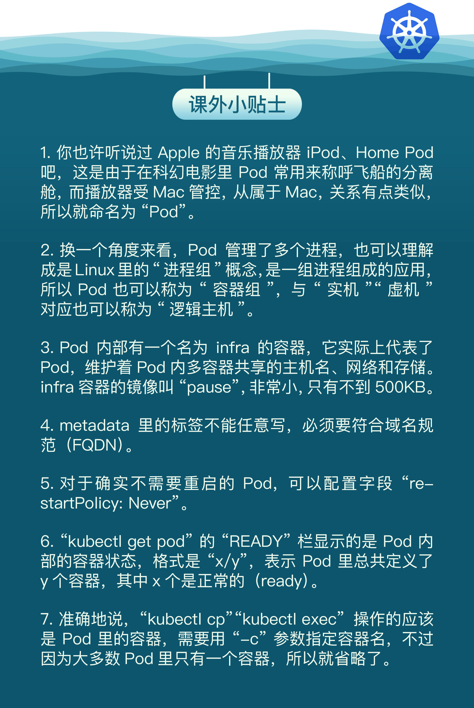

你好，我是Chrono。

前两天我们学习了Kubernetes世界里的工作语言YAML，还编写了一个简短的YAML文件，描述了一个API对象：Pod，它在spec字段里包含了容器的定义。

那么为什么Kubernetes不直接使用已经非常成熟稳定的容器？为什么要再单独抽象出一个Pod对象？为什么几乎所有人都说Pod是Kubernetes里最核心最基本的概念呢？

今天我就来逐一解答这些问题，希望你学完今天的这次课，心里面能够有明确的答案。

## 为什么要有Pod

Pod这个词原意是“豌豆荚”，后来又延伸出“舱室”“太空舱”等含义，你可以看一下这张图片，形象地来说Pod就是包含了很多组件、成员的一种结构。


容器技术我想你现在已经比较熟悉了，它让进程在一个“沙盒”环境里运行，具有良好的隔离性，对应用是一个非常好的封装。

不过，当容器技术进入到现实的生产环境中时，这种隔离性就带来了一些麻烦。因为很少有应用是完全独立运行的，经常需要几个进程互相协作才能完成任务，比如在“入门篇”里我们搭建WordPress网站的时候，就需要Nginx、WordPress、MariaDB三个容器一起工作。

WordPress例子里的这三个应用之间的关系还是比较松散的，它们可以分别调度，运行在不同的机器上也能够以IP地址通信。

但还有一些特殊情况，多个应用结合得非常紧密以至于无法把它们拆开。比如，有的应用运行前需要其他应用帮它初始化一些配置，还有就是日志代理，它必须读取另一个应用存储在本地磁盘的文件再转发出去。这些应用如果被强制分离成两个容器，切断联系，就无法正常工作了。

那么把这些应用都放在一个容器里运行可不可以呢？

当然可以，但这并不是一种好的做法。因为容器的理念是对应用的独立封装，它里面就应该是一个进程、一个应用，如果里面有多个应用，不仅违背了容器的初衷，也会让容器更难以管理。

**为了解决这样多应用联合运行的问题，同时还要不破坏容器的隔离，就需要在容器外面再建立一个“收纳舱”**，让多个容器既保持相对独立，又能够小范围共享网络、存储等资源，而且永远是“绑在一起”的状态。

所以，Pod的概念也就呼之欲出了，容器正是“豆荚”里那些小小的“豌豆”，你可以在Pod的YAML里看到，“spec.containers”字段其实是一个数组，里面允许定义多个容器。

如果再拿之前讲过的“小板房”来比喻的话，Pod就是由客厅、卧室、厨房等预制房间拼装成的一个齐全的生活环境，不仅同样具备易于拆装易于搬迁的优点，而且要比单独的“一居室”功能强大得多，能够让进程“住”得更舒服。

## 为什么Pod是Kubernetes的核心对象

因为Pod是对容器的“打包”，里面的容器是一个整体，总是能够一起调度、一起运行，绝不会出现分离的情况，而且Pod属于Kubernetes，可以在不触碰下层容器的情况下任意定制修改。所以有了Pod这个抽象概念，Kubernetes在集群级别上管理应用就会“得心应手”了。

Kubernetes让Pod去编排处理容器，然后把Pod作为应用调度部署的**最小单位**，Pod也因此成为了Kubernetes世界里的“原子”（当然这个“原子”内部是有结构的，不是铁板一块），基于Pod就可以构建出更多更复杂的业务形态了。

下面的这张图你也许在其他资料里见过，它从Pod开始，扩展出了Kubernetes里的一些重要API对象，比如配置信息ConfigMap、离线作业Job、多实例部署Deployment等等，它们都分别对应到现实中的各种实际运维需求。


不过这张图虽然很经典，参考价值很高，但毕竟有些年头了，随着Kubernetes的发展，它已经不能够全面地描述Kubernetes的资源对象了。

受这张图的启发，我自己重新画了一份以Pod为中心的Kubernetes资源对象关系图，添加了一些新增的Kubernetes概念，今后我们就依据这张图来探索Kubernetes的各项功能。


从这两张图中你也应该能够看出来，所有的Kubernetes资源都直接或者间接地依附在Pod之上，所有的Kubernetes功能都必须通过Pod来实现，所以Pod理所当然地成为了Kubernetes的核心对象。

## 如何使用YAML描述Pod

既然Pod这么重要，那么我们就很有必要来详细了解一下Pod，理解了Pod概念，我们的Kubernetes学习之旅就成功了一半。

还记得吧，我们始终可以用命令 `kubectl explain` 来查看任意字段的详细说明，所以接下来我就只简要说说写YAML时Pod里的一些常用字段。

因为Pod也是API对象，所以它也必然具有**apiVersion**、**kind**、**metadata、spec**这四个基本组成部分。

“apiVersion”和“kind”这两个字段很简单，对于Pod来说分别是固定的值 `v1` 和 `Pod`，而一般来说，“metadata”里应该有 `name` 和 `labels` 这两个字段。

我们在使用Docker创建容器的时候，可以不给容器起名字，但在Kubernetes里，Pod必须要有一个名字，这也是Kubernetes里所有资源对象的一个约定。在课程里，我通常会为Pod名字统一加上 `pod` 后缀，这样可以和其他类型的资源区分开。

`name` 只是一个基本的标识，信息有限，所以 `labels` 字段就派上了用处。它可以添加任意数量的Key-Value，给Pod“贴”上归类的标签，结合 `name` 就更方便识别和管理了。

比如说，我们可以根据运行环境，使用标签 `env=dev/test/prod`，或者根据所在的数据中心，使用标签 `region: north/south`，还可以根据应用在系统中的层次，使用 `tier=front/middle/back` ……如此种种，只需要发挥你的想象力。

下面这段YAML代码就描述了一个简单的Pod，名字是“busy-pod”，再附加上一些标签：

```yaml
apiVersion: v1 kind: Pod metadata: name: busy-pod labels: owner: chrono env: demo region: north tier: back
```

“metadata”一般写上 `name` 和 `labels` 就足够了，而“spec”字段由于需要管理、维护Pod这个Kubernetes的基本调度单元，里面有非常多的关键信息，今天我介绍最重要的“**containers**”，其他的hostname、restartPolicy等字段你可以课后自己查阅文档学习。

“containers”是一个数组，里面的每一个元素又是一个container对象，也就是容器。

和Pod一样，container对象也必须要有一个 `name` 表示名字，然后当然还要有一个 `image` 字段来说明它使用的镜像，这两个字段是必须要有的，否则Kubernetes会报告数据验证错误。

container对象的其他字段基本上都可以和“入门篇”学过的Docker、容器技术对应，理解起来难度不大，我就随便列举几个：

-   **ports**：列出容器对外暴露的端口，和Docker的 `-p` 参数有点像。
-   **imagePullPolicy**：指定镜像的拉取策略，可以是Always/Never/IfNotPresent，一般默认是IfNotPresent，也就是说只有本地不存在才会远程拉取镜像，可以减少网络消耗。
-   **env**：定义Pod的环境变量，和Dockerfile里的 `ENV` 指令有点类似，但它是运行时指定的，更加灵活可配置。
-   **command**：定义容器启动时要执行的命令，相当于Dockerfile里的 `ENTRYPOINT` 指令。
-   **args**：它是command运行时的参数，相当于Dockerfile里的 `CMD` 指令，这两个命令和Docker的含义不同，要特别注意。

现在我们就来编写“busy-pod”的spec部分，添加 `env`、`command`、`args` 等字段：

```yaml
spec: containers: - image: busybox:latest name: busy imagePullPolicy: IfNotPresent env: - name: os value: "ubuntu" - name: debug value: "on" command: - /bin/echo args: - "$(os), $(debug)"
```

这里我为Pod指定使用镜像busybox:latest，拉取策略是 `IfNotPresent` ，然后定义了 `os` 和 `debug` 两个环境变量，启动命令是 `/bin/echo`，参数里输出刚才定义的环境变量。

把这份YAML文件和Docker命令对比一下，你就可以看出，YAML在 `spec.containers` 字段里用“声明式”把容器的运行状态描述得非常清晰准确，要比 `docker run` 那长长的命令行要整洁的多，对人、对机器都非常友好。

## 如何使用kubectl操作Pod

有了描述Pod的YAML文件，现在我就介绍一下用来操作Pod的kubectl命令。

`kubectl apply`、`kubectl delete` 这两个命令在上次课里已经说过了，它们可以使用 `-f` 参数指定YAML文件创建或者删除Pod，例如：

```cpp
kubectl apply -f busy-pod.yml kubectl delete -f busy-pod.yml
```

不过，因为我们在YAML里定义了“name”字段，所以也可以在删除的时候直接指定名字来删除：

```cpp
kubectl delete pod busy-pod
```

和Docker不一样，Kubernetes的Pod不会在前台运行，只能在后台（相当于默认使用了参数 `-d`），所以输出信息不能直接看到。我们可以用命令 `kubectl logs`，它会把Pod的标准输出流信息展示给我们看，在这里就会显示出预设的两个环境变量的值：

```undefined
kubectl logs busy-pod
```


使用命令 `kubectl get pod` 可以查看Pod列表和运行状态：

```csharp
kubectl get pod
```


你会发现这个Pod运行有点不正常，状态是“CrashLoopBackOff”，那么我们可以使用命令 `kubectl describe` 来检查它的详细状态，它在调试排错时很有用：

```sql
kubectl describe pod busy-pod
```


通常需要关注的是末尾的“Events”部分，它显示的是Pod运行过程中的一些关键节点事件。对于这个busy-pod，因为它只执行了一条 `echo` 命令就退出了，而Kubernetes默认会重启Pod，所以就会进入一个反复停止-启动的循环错误状态。

因为Kubernetes里运行的应用大部分都是不会主动退出的服务，所以我们可以把这个busy-pod删掉，用上次课里创建的ngx-pod.yml，启动一个Nginx服务，这才是大多数Pod的工作方式。

```undefined
kubectl apply -f ngx-pod.yml
```

启动之后，我们再用 `kubectl get pod` 来查看状态，就会发现它已经是“Running”状态了：


命令 `kubectl logs` 也能够输出Nginx的运行日志：


另外，kubectl也提供与docker类似的 `cp` 和 `exec` 命令，`kubectl cp` 可以把本地文件拷贝进Pod，`kubectl exec` 是进入Pod内部执行Shell命令，用法也差不多。

比如我有一个“a.txt”文件，那么就可以使用 `kubectl cp` 拷贝进Pod的“/tmp”目录里：

```bash
echo 'aaa' > a.txt kubectl cp a.txt ngx-pod:/tmp
```

不过 `kubectl exec` 的命令格式与Docker有一点小差异，需要在Pod后面加上 `--`，把kubectl的命令与Shell命令分隔开，你在用的时候需要小心一些：

```sql
kubectl exec -it ngx-pod -- sh
```


## 小结

好了，今天我们一起学习了Kubernetes里最核心最基本的概念Pod，知道了应该如何使用YAML来定制Pod，还有如何使用kubectl命令来创建、删除、查看、调试Pod。

Pod屏蔽了容器的一些底层细节，同时又具有足够的控制管理能力，比起容器的“细粒度”、虚拟机的“粗粒度”，Pod可以说是“中粒度”，灵活又轻便，非常适合在云计算领域作为应用调度的基本单元，因而成为了Kubernetes世界里构建一切业务的“原子”。

今天的知识要点我简单列在了下面：

1.  现实中经常会有多个进程密切协作才能完成任务的应用，而仅使用容器很难描述这种关系，所以就出现了Pod，它“打包”一个或多个容器，保证里面的进程能够被整体调度。
2.  Pod是Kubernetes管理应用的最小单位，其他的所有概念都是从Pod衍生出来的。
3.  Pod也应该使用YAML“声明式”描述，关键字段是“spec.containers”，列出名字、镜像、端口等要素，定义内部的容器运行状态。
4.  操作Pod的命令很多与Docker类似，如 `kubectl run`、`kubectl cp`、`kubectl exec` 等，但有的命令有些小差异，使用的时候需要注意。

虽然Pod是Kubernetes的核心概念，非常重要，但事实上在Kubernetes里通常并不会直接创建Pod，因为它只是对容器做了简单的包装，比较脆弱，离复杂的业务需求还有些距离，需要Job、CronJob、Deployment等其他对象增添更多的功能才能投入生产使用。

## 课下作业

最后是课下作业时间，给你留两个思考题：

1.  如果没有Pod，直接使用容器来管理应用会有什么样的麻烦？
2.  你觉得Pod和容器之间有什么区别和联系？

欢迎留言参与讨论，如果有收获也欢迎你分享给朋友一起学习。我们下节课再见。

