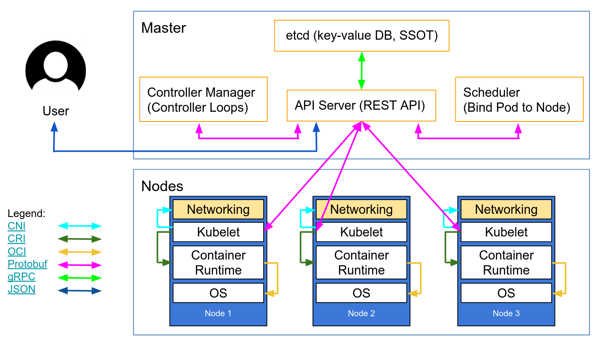
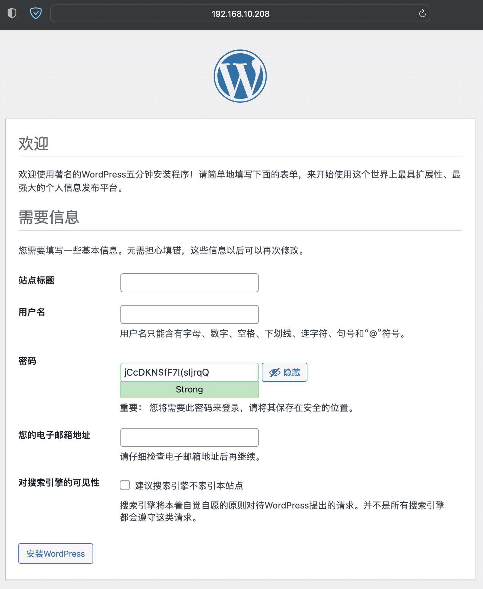
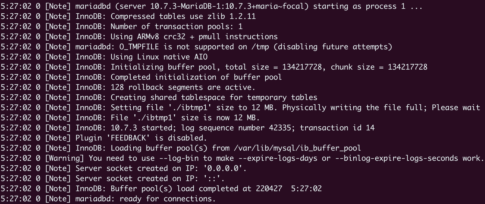
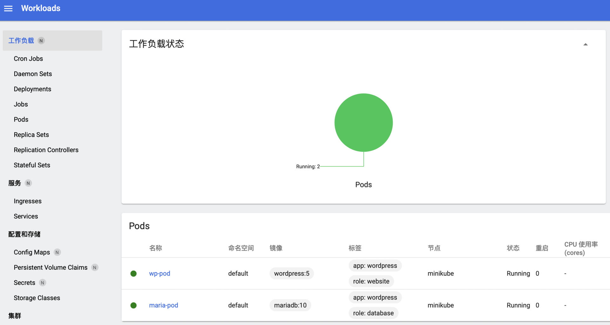
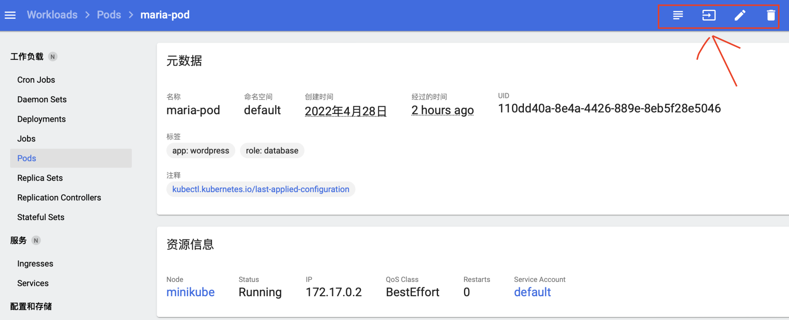
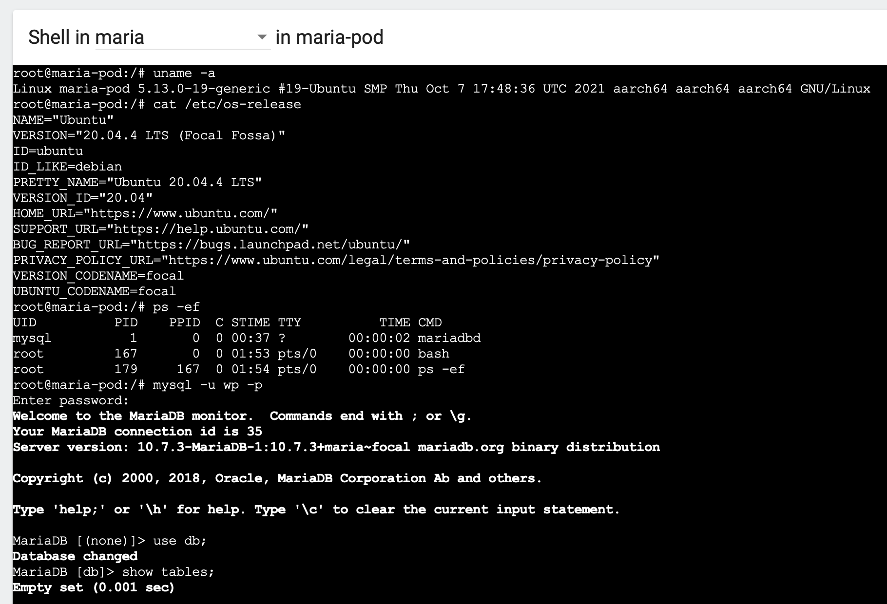
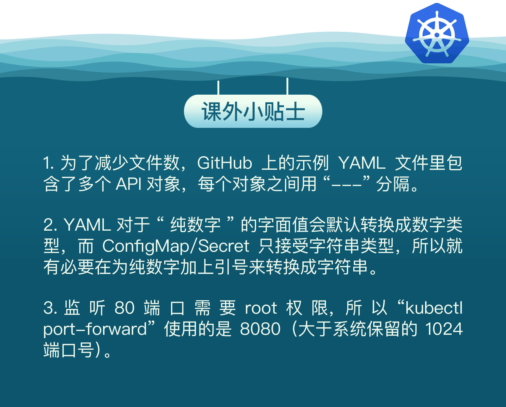

你好，我是Chrono。

经过两个星期的学习，到今天我们的“初级篇”也快要结束了。

和之前的“入门篇”一样，在这次课里，我也会对前面学过的知识做一个比较全面的回顾，毕竟Kubernetes领域里有很多新名词、新术语、新架构，知识点多且杂，这样的总结复习就更有必要。

接下来我还是先简要列举一下“初级篇”里讲到的Kubernetes要点，然后再综合运用这些知识，演示一个实战项目——还是搭建WordPress网站，不过这次不是在Docker里，而是在Kubernetes集群里。

## Kubernetes技术要点回顾

容器技术开启了云原生的大潮，但成熟的容器技术，到生产环境的应用部署的时候，却显得“步履维艰”。因为容器只是针对单个进程的隔离和封装，而实际的应用场景却是要求许多的应用进程互相协同工作，其中的各种关系和需求非常复杂，在容器这个技术层次很难掌控。

为了解决这个问题，**容器编排**（Container Orchestration）就出现了，它可以说是以前的运维工作在云原生世界的落地实践，本质上还是在集群里调度管理应用程序，只不过管理的主体由人变成了计算机，管理的目标由原生进程变成了容器和镜像。

而现在，容器编排领域的王者就是——Kubernetes。

Kubernetes源自Borg系统，它凝聚了Google的内部经验和CNCF的社区智慧，所以战胜了竞争对手Apache Mesos和Docker Swarm，成为了容器编排领域的事实标准，也成为了云原生时代的基础操作系统，学习云原生就必须要掌握Kubernetes。

（\[10讲\]）Kubernetes的**Master/Node架构**是它具有自动化运维能力的关键，也对我们的学习至关重要，这里我再用另一张参考架构图来简略说明一下它的运行机制（[图片来源](https://kubernetes.io/blog/2018/07/18/11-ways-not-to-get-hacked)）：



Kubernetes把集群里的计算资源定义为节点（Node），其中又划分成控制面和数据面两类。

-   控制面是Master节点，负责管理集群和运维监控应用，里面的核心组件是**apiserver、etcd、scheduler、controller-manager**。
-   数据面是Worker节点，受Master节点的管控，里面的核心组件是**kubelet、kube-proxy、container-runtime**。

此外，Kubernetes还支持插件机制，能够灵活扩展各项功能，常用的插件有DNS和Dashboard。

为了更好地管理集群和业务应用，Kubernetes从现实世界中抽象出了许多概念，称为“**API对象**”，描述这些对象就需要使用**YAML**语言。

YAML是JSON的超集，但语法更简洁，表现能力更强，更重要的是它以“**声明式**”来表述对象的状态，不涉及具体的操作细节，这样Kubernetes就能够依靠存储在etcd里集群的状态信息，不断地“调控”对象，直至实际状态与期望状态相同，这个过程就是Kubernetes的自动化运维管理（\[11讲\]）。

Kubernetes里有很多的API对象，其中最核心的对象是“**Pod**”，它捆绑了一组存在密切协作关系的容器，容器之间共享网络和存储，在集群里必须一起调度一起运行。通过Pod这个概念，Kubernetes就简化了对容器的管理工作，其他的所有任务都是通过对Pod这个最小单位的再包装来实现的（\[12讲\]）。

除了核心的Pod对象，基于“单一职责”和“对象组合”这两个基本原则，我们又学习了4个比较简单的API对象，分别是**Job/CronJob**和**ConfigMap**/**Secret**。

-   Job/CronJob对应的是离线作业，它们逐层包装了Pod，添加了作业控制和定时规则（\[13讲\]）。
-   ConfigMap/Secret对应的是配置信息，需要以环境变量或者存储卷的形式注入进Pod，然后进程才能在运行时使用（\[14讲\]）。

和Docker类似，Kubernetes也提供一个客户端工具，名字叫“**kubectl**”，它直接与Master节点的apiserver通信，把YAML文件发送给RESTful接口，从而触发Kubernetes的对象管理工作流程。

kubectl的命令很多，查看自带文档可以用 `api-resources`、`explain` ，查看对象状态可以用 `get`、`describe`、`logs` ，操作对象可以用 `run`、`apply`、`exec`、`delete` 等等（\[09讲\]）。

使用YAML描述API对象也有固定的格式，必须写的“头字段”是“**apiVersion**”“**kind**”“**metadata**”，它们表示对象的版本、种类和名字等元信息。实体对象如Pod、Job、CronJob会再有“**spec**”字段描述对象的期望状态，最基本的就是容器信息，非实体对象如ConfigMap、Secret使用的是“**data**”字段，记录一些静态的字符串信息。

好了，“初级篇”里的Kubernetes知识要点我们就基本总结完了，如果你发现哪部分不太清楚，可以课后再多复习一下前面的课程加以巩固。

## WordPress网站基本架构

下面我们就在Kubernetes集群里再搭建出一个WordPress网站，用的镜像还是“入门篇”里的那三个应用：WordPress、MariaDB、Nginx，不过当时我们是直接以容器的形式来使用它们，现在要改成Pod的形式，让它们运行在Kubernetes里。

我还是画了一张简单的架构图，来说明这个系统的内部逻辑关系：


从这张图中你可以看到，网站的大体架构是没有变化的，毕竟应用还是那三个，它们的调用依赖关系也必然没有变化。

那么Kubernetes系统和Docker系统的区别又在哪里呢？

关键就在**对应用的封装**和**网络环境**这两点上。

现在WordPress、MariaDB这两个应用被封装成了Pod（由于它们都是在线业务，所以Job/CronJob在这里派不上用场），运行所需的环境变量也都被改写成ConfigMap，统一用“声明式”来管理，比起Shell脚本更容易阅读和版本化管理。

另外，Kubernetes集群在内部维护了一个自己的专用网络，这个网络和外界隔离，要用特殊的“端口转发”方式来传递数据，还需要在集群之外用Nginx反向代理这个地址，这样才能实现内外沟通，对比Docker的直接端口映射，这里略微麻烦了一些。

## WordPress网站搭建步骤

了解基本架构之后，接下来我们就逐步搭建这个网站系统，总共需要4步。

**第一步**当然是要编排MariaDB对象，它的具体运行需求可以参考“入门篇”的实战演练课，这里我就不再重复了。

MariaDB需要4个环境变量，比如数据库名、用户名、密码等，在Docker里我们是在命令行里使用参数 `--env`，而在Kubernetes里我们就应该使用ConfigMap，为此需要定义一个 `maria-cm` 对象：

```yaml
apiVersion: v1 kind: ConfigMap metadata: name: maria-cm data: DATABASE: 'db' USER: 'wp' PASSWORD: '123' ROOT_PASSWORD: '123'
```

然后我们定义Pod对象 `maria-pod`，把配置信息注入Pod，让MariaDB运行时从环境变量读取这些信息：

```yaml
apiVersion: v1 kind: Pod metadata: name: maria-pod labels: app: wordpress role: database spec: containers: - image: mariadb:10 name: maria imagePullPolicy: IfNotPresent ports: - containerPort: 3306 envFrom: - prefix: 'MARIADB_' configMapRef: name: maria-cm
```

注意这里我们使用了一个新的字段“**envFrom**”，这是因为ConfigMap里的信息比较多，如果用 `env.valueFrom` 一个个地写会非常麻烦，容易出错，而 `envFrom` 可以一次性地把ConfigMap里的字段全导入进Pod，并且能够指定变量名的前缀（即这里的 `MARIADB_`），非常方便。

使用 `kubectl apply` 创建这个对象之后，可以用 `kubectl get pod` 查看它的状态，如果想要获取IP地址需要加上参数 `-o wide` ：

```csharp
kubectl apply -f mariadb-pod.yml kubectl get pod -o wide
```


现在数据库就成功地在Kubernetes集群里跑起来了，IP地址是“172.17.0.2”，注意这个地址和Docker的不同，是Kubernetes里的私有网段。

接着是**第二步**，编排WordPress对象，还是先用ConfigMap定义它的环境变量：

```yaml
apiVersion: v1 kind: ConfigMap metadata: name: wp-cm data: HOST: '172.17.0.2' USER: 'wp' PASSWORD: '123' NAME: 'db'
```

在这个ConfigMap里要注意的是“HOST”字段，它必须是MariaDB Pod的IP地址，如果不写正确WordPress会无法正常连接数据库。

然后我们再编写WordPress的YAML文件，为了简化环境变量的设置同样使用了 `envFrom`：

```yaml
apiVersion: v1 kind: Pod metadata: name: wp-pod labels: app: wordpress role: website spec: containers: - image: wordpress:5 name: wp-pod imagePullPolicy: IfNotPresent ports: - containerPort: 80 envFrom: - prefix: 'WORDPRESS_DB_' configMapRef: name: wp-cm
```

接着还是用 `kubectl apply` 创建对象，`kubectl get pod` 查看它的状态：

```csharp
kubectl apply -f wp-pod.yml kubectl get pod -o wide
```


**第三步**是为WordPress Pod映射端口号，让它在集群外可见。

因为Pod都是运行在Kubernetes内部的私有网段里的，外界无法直接访问，想要对外暴露服务，需要使用一个专门的 `kubectl port-forward` 命令，它专门负责把本机的端口映射到在目标对象的端口号，有点类似Docker的参数 `-p`，经常用于Kubernetes的临时调试和测试。

下面我就把本地的“8080”映射到WordPress Pod的“80”，kubectl会把这个端口的所有数据都转发给集群内部的Pod：

```yaml
kubectl port-forward wp-pod 8080:80 &
```


注意在命令的末尾我使用了一个 `&` 符号，让端口转发工作在后台进行，这样就不会阻碍我们后续的操作。

如果想关闭端口转发，需要敲命令 `fg` ，它会把后台的任务带回到前台，然后就可以简单地用“Ctrl + C”来停止转发了。

**第四步**是创建反向代理的Nginx，让我们的网站对外提供服务。

这是因为WordPress网站使用了URL重定向，直接使用“8080”会导致跳转故障，所以为了让网站正常工作，我们还应该在Kubernetes之外启动Nginx反向代理，保证外界看到的仍然是“80”端口号。（这里的细节和我们的课程关系不大，感兴趣的同学可以留言提问讨论）

Nginx的配置文件和\[第7讲\]基本一样，只是目标地址变成了“127.0.0.1:8080”，它就是我们在第三步里用 `kubectl port-forward` 命令创建的本地地址：

```perl
server { listen 80; default_type text/html; location / { proxy_http_version 1.1; proxy_set_header Host $host; proxy_pass http://127.0.0.1:8080; } }
```

然后我们用 `docker run -v` 命令加载这个配置文件，以容器的方式启动这个Nginx代理：

```bash
docker run -d --rm \ --net=host \ -v /tmp/proxy.conf:/etc/nginx/conf.d/default.conf \ nginx:alpine
```


有了Nginx的反向代理之后，我们就可以打开浏览器，输入本机的“127.0.0.1”或者是虚拟机的IP地址（我这里仍然是“[http://192.168.10.208](http://192.168.10.208/)”），看到WordPress的界面：



你也可以在Kubernetes里使用命令 `kubectl logs` 查看WordPress、MariaDB等Pod的运行日志，来验证它们是否已经正确地响应了请求：



## 使用Dashboard管理Kubernetes

到这里WordPress网站就搭建成功了，我们的主要任务也算是完成了，不过我还想再带你看看Kubernetes的图形管理界面，也就是Dashboard，看看不用命令行该怎么管理Kubernetes。

启动Dashboard的命令你还记得吗，在第10节课里讲插件的时候曾经说过，需要用minikube，命令是：

```undefined
minikube dashboard
```

它会自动打开浏览器界面，显示出当前Kubernetes集群里的工作负载：



点击任意一个Pod的名字，就会进入管理界面，可以看到Pod的详细信息，而右上角有4个很重要的功能，分别可以查看日志、进入Pod内部、编辑Pod和删除Pod，相当于执行 `logs`、`exec`、`edit`、`delete` 命令，但要比命令行要直观友好的多：



比如说，我点击了第二个按钮，就会在浏览器里开启一个Shell窗口，直接就是Pod的内部Linux环境，在里面可以输入任意的命令，无论是查看状态还是调试都很方便：



ConfigMap/Secret等对象也可以在这里任意查看或编辑：


Dashboard里的可操作的地方还有很多，这里我只是一个非常简单的介绍。虽然你也许已经习惯了使用键盘和命令行，但偶尔换一换口味，改用鼠标和图形界面来管理Kubernetes也是件挺有意思的事情，有机会不妨尝试一下。

## 小结

好了，作为“初级篇”的最后一节课，今天我们回顾了一下Kubernetes的知识要点，我还是画一份详细的思维导图，帮助你课后随时复习总结。


这节课里我们使用Kubernetes搭建了WordPress网站，和第7讲里的Docker比较起来，我们应用了容器编排技术，以“声明式”的YAML来描述应用的状态和它们之间的关系，而不会列出详细的操作步骤，这就降低了我们的心智负担——调度、创建、监控等杂事都交给Kubernetes处理，我们只需“坐享其成”。

虽然我们朝着云原生的方向迈出了一大步，不过现在我们的容器编排还不够完善，Pod的IP地址还必须手工查找填写，缺少自动的服务发现机制，另外对外暴露服务的方式还很原始，必须要依赖集群外部力量的帮助。

所以，我们的学习之旅还将继续，在接下来的“中级篇”里，会开始研究更多的API对象，来解决这里遇到的问题。

## 课下作业

最后是课下作业时间，给你留两个动手题：

1.  MariaDB、WordPress现在用的是ConfigMap，能否改用Secret来实现呢？
2.  你能否把Nginx代理转换成Pod的形式，让它在Kubernetes里运行呢？

期待能看到你动手体验后的想法，如果觉得有帮助，欢迎分享给自己身边的朋友一起学习。

下节课就是视频演示的操作课了，我们下节课再见。

