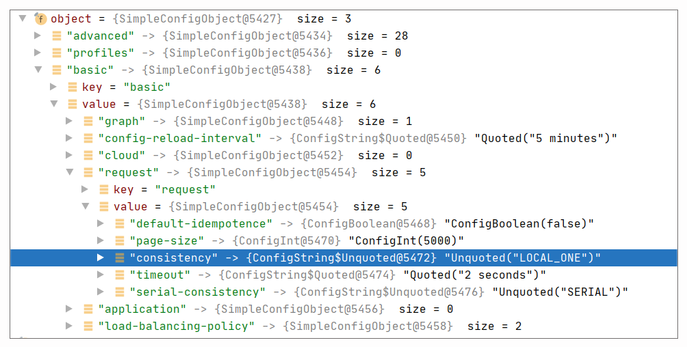
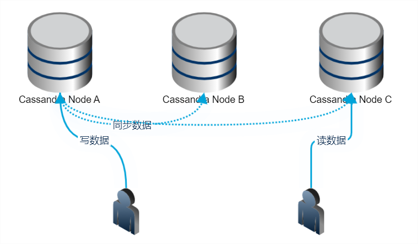
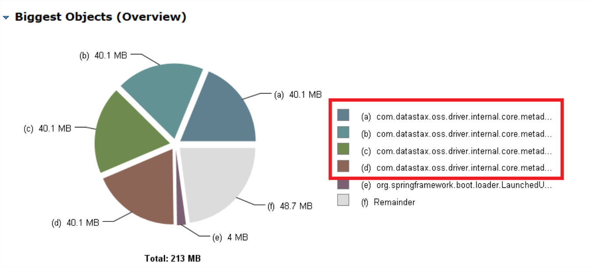
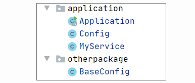

你好，我是傅健。

上一章节我们学习了 Spring Web 开发的常见错误。那么从这节课开始，我们将重点关注其他的一些 Spring 工具使用上的错误。

实际上，除了 Spring Web 外，Spring 还提供了很多其他好用的工具集，Spring Data 就是这样的存在。众所周知，基本上所有的项目都会用到数据库，所以 Spring 提供了对市场上主流数据库的贴心支持，我们不妨通过下面的列表快速浏览下：

> Spring Data Commons- Spring Data JPA- Spring Data KeyValue- Spring Data LDAP- Spring Data MongoDB- Spring Data Redis- Spring Data REST- Spring Data for Apache Cassandra- Spring Data for Apache Geode- Spring Data for Apache Solr- Spring Data for Pivotal GemFire- Spring Data Couchbase (community module)- Spring Data Elasticsearch (community module)- Spring Data Neo4j (community module)

而在你使用这些各种各样的数据库时，难免会遇到问题，接下来我会选取3个典型案例，为你总结下那些高频问题。

## 案例 1：注意读与取的一致性

当使用 Spring Data Redis 时，我们有时候会在项目升级的过程中，发现存储后的数据有读取不到的情况；另外，还会出现解析出错的情况。这里我们不妨直接写出一个错误案例来模拟下：

```csharp
@SpringBootApplication public class SpringdataApplication { SpringdataApplication(RedisTemplate redisTemplate, StringRedisTemplate stringRedisTemplate){ String key = "mykey"; stringRedisTemplate.opsForValue().set(key, "myvalue"); Object valueGotFromStringRedisTemplate = stringRedisTemplate.opsForValue().get(key); System.out.println(valueGotFromStringRedisTemplate); Object valueGotFromRedisTemplate = redisTemplate.opsForValue().get(key); System.out.println(valueGotFromRedisTemplate); } public static void main(String[] args) { SpringApplication.run(SpringdataApplication.class, args); } }
```

在上述代码中，我们使用了 Redis 提供的两种 Template，一种 RedisTemplate，一种 stringRedisTemplate。但是当我们使用后者去存一个数据后，你会发现使用前者是取不到对应的数据的。输出结果如下：

> myvalue- null

此时你可能会想，这个问题不是很简单么？肯定是这两个 Template 不同导致的。

没错，这是一个极度简化的案例，我们的学习目的是举一反三。你可以试想一下，如果我们是不同的开发者开发不同的项目呢？一个项目只负责存储，另外一个项目只负责读取，两个项目之间缺乏沟通和协调。这种问题在实际工作中并不稀奇，接下来我们就了解下这个问题背后的深层次原因。

### 案例解析

要了解这个问题，需要我们对 Spring Data Redis 的操作流程有所了解。

首先，我们需要认清一个现实：我们不可能直接将数据存取到 Redis 中，毕竟一些数据是一个对象型，例如 String，甚至是一些自定义对象。我们需要在存取前对数据进行序列化或者反序列化操作。

具体到我们的案例而言，当带着key去存取数据时，它会执行 AbstractOperations#rawKey，使得在执行存储 key-value 到 Redis，或从 Redis 读取数据之前，对 key 进行序列化操作：

```csharp
byte[] rawKey(Object key) { Assert.notNull(key, "non null key required"); if (keySerializer() == null && key instanceof byte[]) { return (byte[]) key; } return keySerializer().serialize(key); }
```

从上述代码可以看出，假设存在 keySerializer，则利用它将 key 序列化。而对于 StringRedisSerializer 来说，它指定的其实是 StringRedisSerializer。具体实现如下：

```typescript
public class StringRedisSerializer implements RedisSerializer<String> { private final Charset charset; @Override public byte[] serialize(@Nullable String string) { return (string == null ? null : string.getBytes(charset)); } }
```

而如果我们使用的是 RedisTemplate，则使用的是 JDK 序列化，具体序列化操作参考下面的实现：

```typescript
public class JdkSerializationRedisSerializer implements RedisSerializer<Object> { @Override public byte[] serialize(@Nullable Object object) { if (object == null) { return SerializationUtils.EMPTY_ARRAY; } try { return serializer.convert(object); } catch (Exception ex) { throw new SerializationException("Cannot serialize", ex); } } }
```

很明显，上面对 key 的处理，采用的是 JDK 的序列化，最终它调用的方法如下：

```csharp
public interface Serializer<T> { void serialize(T var1, OutputStream var2) throws IOException; default byte[] serializeToByteArray(T object) throws IOException { ByteArrayOutputStream out = new ByteArrayOutputStream(1024); this.serialize(object, out); return out.toByteArray(); } }
```

你可以直接将”mykey”这个字符串分别用上面提到的两种序列化器进行序列化，你会发现它们的结果确实不同。这也就解释了为什么它们不能读取到”mykey”设置的”myvalue”。

至于它们是如何指定 RedisSerializer 的，我们可以以 StringRedisSerializer 为例简单看下。查看下面的代码，它是 StringRedisSerializer 的构造器，在构造器中，它直接指定了KeySerializer为 RedisSerializer.string()：

```csharp
public class StringRedisTemplate extends RedisTemplate<String, String> { public StringRedisTemplate() { setKeySerializer(RedisSerializer.string()); setValueSerializer(RedisSerializer.string()); setHashKeySerializer(RedisSerializer.string()); setHashValueSerializer(RedisSerializer.string()); } }
```

其中 RedisSerializer.string()最终返回的实例如下：

> public static final StringRedisSerializer UTF\_8 = new StringRedisSerializer(StandardCharsets.UTF\_8);

### 案例修正

要解决这个问题，非常简单，就是检查自己所有的数据操作，是否使用了相同的 RedisTemplate，就是相同，也要检查所指定的各种Serializer是否完全一致，否则就会出现各式各样的错误。

## 案例 2：默认值的错误

当我们使用 Spring Data 时，就像其他 Spring 模块一样，为了应对大多数场景或者方便用户使用，Spring Data 都有很多默认值，但是不见得所有的默认值都是最合适的。

例如在一个依赖 Cassandra 的项目中，有时候我们在写入数据之后，并不能立马读到写入的数据。这里面可能是什么原因呢？这种错误并没有什么报错，一切都是正常的，只是读取不到数据而已。

### 案例解析

当我们什么都不去配置，而是直接使用 Spring Data Cassandra 来操作时，我们实际依赖了 Cassandra driver 内部的配置文件，具体目录如下：

> .m2\\repository\\com\\datastax\\oss\\java-driver-core\\4.6.1\\java-driver-core-4.6.1.jar!\\reference.conf

我们可以看下它存在很多默认的配置，其中一项很重要的配置是 Consistency，在 driver 中默认为 LOCAL\_ONE，具体如下：

```php
basic.request { # The consistency level. # # Required: yes # Modifiable at runtime: yes, the new value will be used for requests issued after the change. # Overridable in a profile: yes consistency = LOCAL_ONE //省略其他非关键配置 }
```

所以当我们去执行读写操作时，我们都会使用 LOCAL\_ONE。参考下面的运行时配置调试截图：



如果你稍微了解下 Cassandra 的话，你就知道 Cassandra 使用的一个核心原则，就是要使得R（读）+W（写）>N，即读和写的节点数之和需要大于备份数。

例如，假设我们的数据备份是 3 份，待写入的数据分别存储在 A、B、C 三个节点上。那么常见的搭配是 R（读）和 W（写）的一致性都是 LOCAL\_QURAM，这样可以保证能及时读到写入的数据；而假设在这种情况下，我们读写都是用 LOCAL\_ONE，那么则可能发生这样的情况，即用户写入一个节点 A 就返回了，但是用户 B 立马读的节点是 C，且由于是 LOCAL\_ONE 一致性，则读完 C 就可以立马返回。此时，就会出现数据读取可能落空的情况。



那么考虑一个问题，为什么 Cassandra driver 默认是使用 LOCAL\_ONE 呢？

实际上，当你第一次学习和应用 Cassandra 时，你一定会先只装一台机器玩玩。此时，设置为 LOCAL\_ONE 其实是最合适的，也正因为只有一台机器，你的读写都只能命中一台。这样的话，读写是完全没有问题的。但是产线上的 Cassandra 大多都是多数据中心多节点的，备份数大于1。所以读写都用 LOCAL\_ONE 就会出现问题。

### 案例修正

通过这个案例的分析，我们知道 Spring Data Cassandra 的默认值不见得适应于所有情况，甚至说，不一定适合于产线环境，所以这里我们不妨修改下默认值，还是以 consistency 为例。

我们看下如何修改它：

```typescript
@Override protected SessionBuilderConfigurer getSessionBuilderConfigurer() { return cqlSessionBuilder -> { DefaultProgrammaticDriverConfigLoaderBuilder defaultProgrammaticDriverConfigLoaderBuilder = new DefaultProgrammaticDriverConfigLoaderBuilder(); driverConfigLoaderBuilderCustomizer().customize(defaultProgrammaticDriverConfigLoaderBuilder); cqlSessionBuilder.withConfigLoader(defaultProgrammaticDriverConfigLoaderBuilder.build()); return cqlSessionBuilder; }; } @Bean public DriverConfigLoaderBuilderCustomizer driverConfigLoaderBuilderCustomizer() { return loaderBuilder -> loaderBuilder .withString(REQUEST_CONSISTENCY, ConsistencyLevel.LOCAL_QUORUM.name()) }
```

这里我们将一致性级别从 LOCAL\_ONE 改成了 LOCAL\_QUARM，更符合我们的实际产品部署和应用情况。

## 案例 3：冗余的 Session

有时候，我们使用 Spring Data 做连接时，会比较在意我们的内存占用。例如我们使用 Spring Data Cassandra 操作 Cassandra 时，可能会发现类似这样的问题：



Spring Data Cassandra 在连接 Cassandra 之后，会获取 Cassandra 的 Metadata 信息，这个内存占用量是比较大的，因为它存储了数据的 Token Range 等信息。如上图所示，在我们的应用中，占用 40M 以上已经不少了，但问题是为什么有 4 个占用 40 多 M 呢？难道不是只建立一个连接么？

### 案例解析

要定位这个问题，或许不是特别难，我们只要找到获取 Metadata 的地方加个断点，然后找出触发获取的源头即可。但是毕竟这是 Spring Data 间接操作，Cassandra driver 本身就可能够复杂了，再加上 Spring Data 的复杂度，想迅速定位问题的根源其实也不是一件容易的事情。

这里我们可以先写一个例子，直接展示下问题的原因，然后再来看看我们的问题到底出现在什么地方！

现在我们定义一个 MyService 类，当它构造时，会输出它的名称信息：

```cpp
public class MyService { public MyService(String name){ System.err.println(name); } }
```

然后我们定义两个 Configuration 类，同时让它们是继承关系，其中父 Configuration 命名如下：

```typescript
@Configuration public class BaseConfig { @Bean public MyService service(){ return new MyService("myservice defined from base config"); } }
```

子 Configuration 命名如下：

```java
@Configuration public class Config extends BaseConfig { @Bean public MyService service(){ return new MyService("myservice defined from config"); } }
```

子类的 service() 实现覆盖了父类对应的方法。最后，我们书写一个启动程序：

```typescript
@SpringBootApplication public class Application { public static void main(String[] args) { SpringApplication.run(Application.class, args); } }
```

为了让程序启动，我们不能将 BaseConfig 和 Config 都放到 Application 的扫描范围。我们可以按如下结构组织代码：



最终我们会发现，当程序启动时，我们只有一个 MyService 的 Bean 产生，输出日志如下：

> myservice defined from config

这里可以看出，如果我们的子类标识 Bean 的方法正好覆盖了对应的父类，那么只能利用子类的方法产生一个 Bean。

但是假设我们不小心在子类实现时，没有意识到父类方法的存在，定义如下呢？

```java
@Configuration public class Config extends BaseConfig { @Bean public MyService service2(){ return new MyService("myservice defined from config"); } }
```

经过上述的不小心修改，再次运行程序，你会发现有 2 个 MyService 的 Bean 产生：

> myservice defined from config- myservice defined from base config

说到这里你可能想到一个造成内存翻倍的原因。我们去查看案例程序的代码，可能会发现存在这样的问题：

```java
@Configuration @EnableCassandraRepositories public class CassandraConfig extends AbstractCassandraConfiguration @Bean @Primary public CqlSessionFactoryBean session() { log.info("init session"); CqlSessionFactoryBean cqlSessionFactoryBean = new CqlSessionFactoryBean(); //省略其他非关键代码 return cqlSessionFactoryBean ; } //省略其他非关键代码 }
```

CassandraConfig 继承于 AbstractSessionConfiguration，它已经定义了一个 CqlSessionFactoryBean，代码如下：

```java
@Configuration public abstract class AbstractSessionConfiguration implements BeanFactoryAware @Bean public CqlSessionFactoryBean cassandraSession() { CqlSessionFactoryBean bean = new CqlSessionFactoryBean(); bean.setContactPoints(getContactPoints()); //省略其他非关键代码 return bean; } //省略其他非关键代码 }
```

而比较这两段的 CqlSessionFactoryBean 的定义方法，你会发现它们的方法名是不同的：

> cassandraSession()- session()

所以结合前面的简单示例，相信你已经明白问题出在哪了！

### 案例修正

我们只要几秒钟就能解决这个问题。我们可以把原始案例代码修改如下：

```less
@Configuration @EnableCassandraRepositories public class CassandraConfig extends AbstractCassandraConfiguration @Bean @Primary public CqlSessionFactoryBean cassandraSession() { //省略其他非关键代码 } //省略其他非关键代码 }
```

这里我们将原来的方法名session改成cassandraSession。不过你可能会有一个疑问，这里不就是翻倍了么？但也不至于四倍啊。

实际上，这是因为使用 Spring Data Cassandra 会创建两个Session，它们都会获取metadata。具体可参考代码CqlSessionFactoryBean#afterPropertiesSet：

```kotlin
@Override public void afterPropertiesSet() { CqlSessionBuilder sessionBuilder = buildBuilder(); // system session 的创建 this.systemSession = buildSystemSession(sessionBuilder); initializeCluster(this.systemSession); // normal session 的创建 this.session = buildSession(sessionBuilder); executeCql(getStartupScripts().stream(), this.session); performSchemaAction(); this.systemSession.refreshSchema(); this.session.refreshSchema(); }
```

上述代码中的 systemSession 和 session 即为上文提及的两个 Session。

## 重点回顾

学习完这3个案例，我们会发现，有些错误的直接结果很严重，以至于你很快就能定位并解决问题，但有一些问题会很隐蔽，例如案例 2 引发的问题就是如此，因为它不能 100%被重现。

结合案例，我们可以总结出使用 Spring Data 时必须注意的一些关键点：

1.  一定要注意一致性，例如读写的序列化方法需要一致；
2.  一定要重新检查下所有的默认配置是什么，是否符合当前的需求，例如在 Spring Data Cassandra 中，默认的一致性级别在大多情况下都不适合；
3.  如果你自定义自己的Session，一定要避免冗余的Session产生。

记住这3点，你就能规避不少 Spring Data 使用上的问题了。

## 思考题

在案例 1 中使用 Spring Data Redis 时，我们提到了 StringRedisTemplate 和 RedisTemplate。那么它们是如何被创建起来的呢？

期待你的思考，我们留言区见。