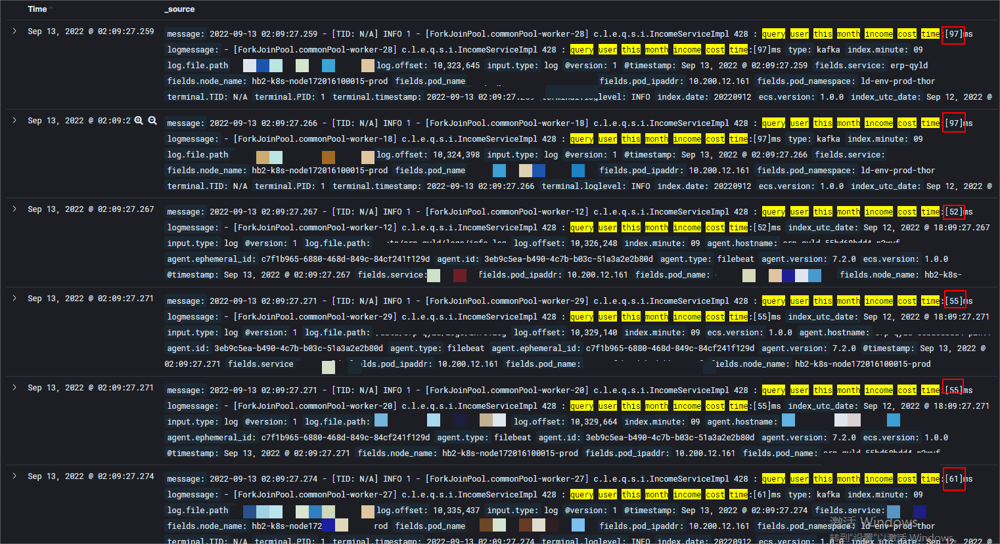

# 一、问题现象

某项目版本V3.1.0于9.14日发版后，于凌晨04:50收到任务执行失败的告警：

登录到xxl-job-admin后台，发现是任务执行超时了，

通过查看该任务过去几天的执行情况，如下图所示：

基本都是一个半小时就能跑完，而我们配置的超时时间是9000秒，这样看来就算冗余了一个小时，但任务还是没有执行完。

接下来我们尝试对问题进行分析。

# 二、问题分析

## 思路一：排查代码变更情况

9月14日之前都没有问题，所以先排查最近上线的版本，怀疑是有代码变更导致，通过查看Jenkins的发布历史记录，如下图所示：

发现9月13日有发版(配合该版本V3.1.0)，编号#175 PROD的任务发布包编号为#1289-master，查看#1289-master的代码变更历史，如下图所示：

发现变更历史没有涉及到`x.x.x.x.tasks.HomePageIncomeJobHandler`这个类相关的更新。

故排除因代码变更导致任务执行变慢的原因。

## 思路二：通过监控排查资源占用情况

通过运维同事分别检查了erp-xxx项目的CPU、内存、网络等资源的使用情况以及连接的各个数据库，各项指标均正常，且对比前几天没有出现太大的资源波动，排除因资源问题导致任务执行变慢的原因。

## 思路三：代码逻辑分析

`x.x.x.x.tasks.HomePageIncomeJobHandler` 这个xxl-job的主要逻辑如下图所示：

#220行是分页查询用户列表，通过对比9月14日与13日的执行耗时情况，如下图所示：

对比下来发现没有太大区别，平均都在10-20ms之间。

我们继续查看#226行的日志，如下图分别对应14日和13日的日志：

这行日志对比就比较明显了，**14日执行一批数据平均要15秒，而13日执行一批数据平均只要5-6秒，结合代码推测问题出在#225行的`this.updateShopIncome(userId, balanceDay)`这个方法内**。

进入`this.updateShopIncome(userId, balanceDay)`方法，其主要逻辑如下图所示：

这个方法体包含四次查询和一次写入，我们分别来对比这五次读写操作14日与13日的执行情况，以期能定位到性能瓶颈：

### 1、query user income cost time

如下图所示为#412行代码日志分别在14日和13日执行的情况：

对比后，并无太大变化。

### 2、query user yesterday income cost time

如下图所示为#421行代码日志分别在14日和13日执行的情况：

从数量级上来看，14日相比13日这个操作耗时反而更短了，我们继续往下看。

### 3、query user this month income cost time

如下图所示为#425行代码日志分别在14日和13日执行的情况：

对比下来发现，与第2步类似，数量级没有发生变化，但平均来看14日的执行耗时比13日的要短。

### 4、query user total income cost time

如下图所示为#429行代码日志分别在14日和13日执行的情况：

对比发现，第4步在14日与13日耗时几乎一样。

### 5、update user income cost time

如下图所示为#440行代码日志分别在14日和13日执行的情况：

对比过后，第5步数据写入耗费都在十几毫秒。

综合以上5步的耗时来看，除了第2、3步 14日相比13日耗时短以外，其余步骤耗时几乎一样，按理说执行一次方法`this.updateShopIncome(userId, balanceDay)` 14日耗时比13日短，同样一批数据(1000条)，14日应该比13日耗时更短才行，这与前面我们通过日志发现的结论自相矛盾。

看来问题不是出现在`this.updateShopIncome(userId, balanceDay)` 这个方法内，我们再回到`public void updateShopIncome(String balanceDay) ` 这个方法的#225行。这行代码用到了java8 的 `stream().parallel()`语法，于是我们猜测，会不会是因为流的并行度下降了导致的呢？因为单次方法的执行耗时没有太大变化，一个批次的数据总量(最大1000条)也没有变化，只有当并行度下降了才符合前面日志的结论。

### 6、ForkJoinPool源码分析

我们知道，java8并行流底层是公用了`java.util.concurrent.ForkJoinPool`类中的`common` 这个线程池，该类中有一个全局的ForkJoinPool，如下图所示：

它的初始化过程位于类的static代码块中，如下图所示：

原来它是通过`makeCommonPool()`这个方法来完成初始化的，继续跟踪这个方法的初始化过程，如下图所示：

这段代码我们重点关注图中依次标注为1、2、3三个部分的代码：

标记1：读取全局配置变量`java.util.concurrent.ForkJoinPool.common.parallelism` 作为并行度的配置，默认情况下一般是没有配置的

标记2：默认取JVM的CPU核心数-1作为并行度(线程编号从0开始，实际还是32个线程在运行编号为0-31)，比如32核的话，并行度为32；8核的话，并行度就是8

标记3：约定了ForkJoinPool的线程名前缀为`ForkJoinPool.commonPool-worker-`

在前面的排查过程中，我们一直在关注每段代码的执行时间，忽略了日志中的线程名，接下来我们对比`this.updateShopIncome(userId, balanceDay)`这个方法执行期间14日与13日线程的线程名，看看能否有新的发现，

仔细观察会发现，13日日志中线程的编号明显要比14日线程的编号要大，进一步查询我们会发现13日线程编号最大可达31，而14日线程编号最大只能到7，如下图所示：

结合上面分析`makeCommonPool()`这个方法中的标记2逻辑，可以反向推导出13日及之前Java虚拟机读取到的CPU核数是32核，14日读取到的CPU核数是8核。正因如此，才使得整个任务的执行时长增加到原来的4倍左右。

分析到这里，联想到7月末8月初的时候运维团队有提到会将生产环境K8S中的容器进行资源上限的设置，于是去询问相关同事，答复确实已经实施完这个设置。

但还有一个疑问，按说8月初的时候就已经设置完，为什么一直到9月14日这个配置才生效呢？原来运维设置完之后，应用需要重新打包并部署配置才会生效，而在上文思路一的排查中我们看到，erp-xxx这个项目从7月14日到9月13日之间是没有发过任何版本的，9月13日为配合订单相关的功能所以才对erp-xxx进行了发布，9月14日凌晨触发任务执行就发生了开篇提到的问题。

# 三、问题结论

综合以上分析，本次问题出现的基本情况可以归纳为：

1、运维团队于8月初对生产K8S容器完成了资源上限的设置，目前一个应用CPU限制为最多使用8核

2、业务代码间接使用了JDK提供的ForkJoinPool，其初始并行度为JAVA虚拟机读取到的CPU核数

3、9月13日erp-xxx项目发版触发了资源上限配置的生效，导致原来都是以32的并行度执行的任务，降为8的并行度来执行，使得任务执行时间增加，超过了既定的超时时间

换言之，出现这个问题与V3.1.0版本的发布是没有关系的。只要在这个时间段内迭代过erp-xxx项目，都会触发这个任务执行变慢，只是凑巧V3.1.0版本的子项目中需要变更erp-xxx，所以才导致问题的发生，所幸9月14日凌晨开启了业务端的维护公告，以上所述问题对用户并未产生实际影响。

# 四、问题解决
## 4.1 临时解决方案

临时解决方案先把任务的超时时间设置长一些(或者暂时不给任务设置超时时间)，然后重新触发任务，让任务跑完一个周期。只是这样从凌晨2点开始触发，原来正常情况下3点多能跑完数据，现在要到6点多才能跑完数据，会影响首页用户查看前一天收入的功能，临时处理还可以接受，但常态化终究不是解决之道。

## 4.2 根本解决方案

前文分析`makeCommonPool()`方法的标记1中我们看到，JDK给我们预留了指定ForkJoinPool并行度的配置，即 `java.util.concurrent.ForkJoinPool.common.parallelism` ，在不改变业务代码的情况下，我们是否可以通过在应用启动过程中指定该配置来达到跟设置资源上限之前的并行度一样的效果。

在运维同事的帮助下，我们在erp-qyld应用JVM启动参数中添加了 ` -D java.util.concurrent.ForkJoinPool.common.parallelism=32 ` ，打包验证后，其效果符合我们的预期，修改后的执行情况如下图所示：

任务的执行效率已经恢复到14日之前。