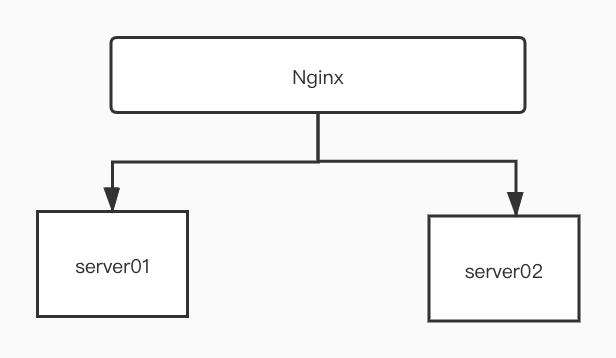

# WebSocket handsharke with 5 seconds delay

## 背景

某日产品上线后，产品同事体验后反馈说第一次打开某功能页面特别慢，要等好几秒才能正常渲染，后面经过前端开发同事的跟踪，反馈是说建立websocket连接阶段特别慢，要好几秒后才能建立完成，从而产生产品反馈的第一次打开功能页较慢的现象。这个问题在DEV和QA服务器上均没有出现。

## 问题分析

基于以上现象，初步推测是生产服务器的某项配置有问题，但具体是哪项配置有问题，我们不得而知。于是，我们首先去了解了该服务在生产上的部署架构，如下图所示：

该服务通过Nginx实现两台server的负载均衡，由于应用在内存中维护了websocket通道与登录用户的关系，所以Nginx在负载均衡的时候选择了会话保持的负载均衡策略，通过应用日志可以发现，只有落到server01这台服务器的请求在handsharke阶段会持续5S左右，另外一台server02 handshake阶段只有几个毫秒，与QA和DEV环境类似。

而且通过多次测试观察发现，server01的handsharke阶段总是会延迟5S，为什么不是1S、3S或者10S，却一直是5S？进一步证实是server01这台机器的某项网络配置有问题，但依然没有办法进一步缩小排查范围。于是我们想到通过debug线上应用来跟踪，看看到底是延迟在哪一个步骤上；考虑到debug线上应用，一方面要重启应用会产生告警，另一方面也会影响用户的使用，所以我们考虑单独写一个websocket的server程序，部署到server01这台机器，通过debug来跟踪它的handsharke过程。从上面的分析来看，我们有理由相信在这台server上的websocket handsharke都会出现延迟。

## 重现步骤

1、编写[springboot-websocket](https://github.com/grapeqin/springboot-websocket.git)的调试程序，来观察handsharke的完整过程

2、将打包好的应用上传到server01，通过在IDEA 创建debug的命令行启动参数，在server01上启动该应用的完整命令如下所示：

>   java -jar -agentlib:jdwp=transport=dt_socket,server=y,suspend=n,address=5050 springboot-websocket-0.0.1-SNAPSHOT.jar

3、在IDEA中以debug模式启动springboot-websocket，由于spring-websocket中处理handsharke的类会经过AbstractHandsharkeHandler的doHandshake方法，如下图所示，我们在该方法的入口处增加断点

4、通过 [websocket在线模拟工具](http://coolaf.com/tool/chattest) ，模拟请求

>   ws://xxx.xxx.xxx.xxx:8080/myHandler

点击 ”连接“ 按钮，IDEA会捕捉到该请求，通过一步步跟踪，会发现程序会hang在如下图所示的位置

这里是JDK提供的类，通过注释可以知道该构造器目的是解析主机名来构建InetSocketAddress对象，给出了一个提示信息可能跟域名解析有关，所以我们通过如下命令打开server01主机的域名解析配置文件。

>   cat /etc/resolve.conf

通过与server02主机配置进行对比，果然发现server01比server02在首行多配置了一条nameserver，我们尝试让运维同事去掉这条多余的配置，再次跟踪，handsharke过程恢复。

后来我们又去查阅资料，为什么延迟是5S而不是其他的时间，这是因为域名解析默认的timeout是5S，具体的解释信息请参考：https://www.math.tamu.edu/~comech/tools/linux-slow-dns-lookup/