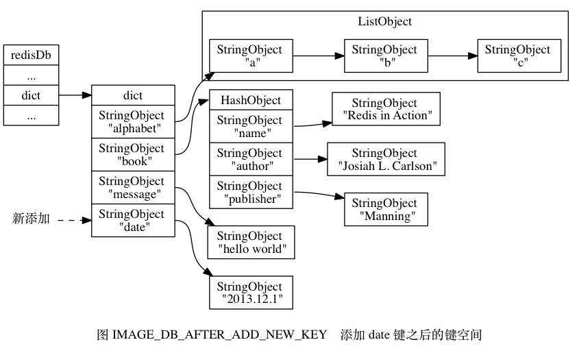
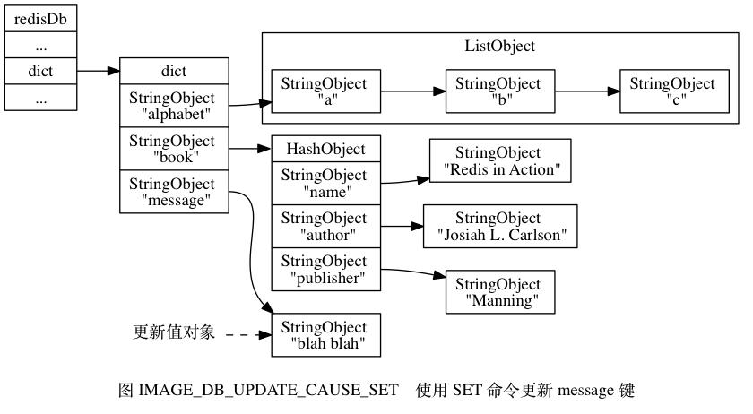

# Redis数据库

## 1.服务器中的数据库

Redis服务器将所有数据库都保存在服务器状态server.h/redisServer结构的db数组中，db数组的每个项都是server.h/redisDb结构，每个redisDb实例代表一个数据库：

```c
typedef struct redisServer {
  //...
  //一个数组，保存着服务器中的所有数据库
  redisDb *db;
  //...
} redisServer;
```

在初始化服务器时，程序会根据服务器状态的dbnum属性来决定应该创建多少个数据库

```c
typedef struct redisServer {
  //...
  //服务器的数据库数量
	int dbnum;
  //...
} redisServer;
```

dbnum 属性的值由服务器配置文件中的database选项决定，默认情况下，该选项的值为16，所以Redis服务器默认会创建16个数据库，如图所示：


## 2.切换数据库

每个客户端都有自己的目标数据库，每当客户端执行写入或者读取命令的时候，目标数据库就会成为这些命令的操作对象。

默认情况下，Redis客户端的目标数据库为0号数据库，但客户端可以通过执行SELECT命令来切换目标数据库。

下面的命令演示了在0号数据库设置并读取键值msg，之后切换到2号数据库并执行类似操作的过程：

```powershell
# 默认操作0号数据库
127.0.0.1:6379> SET msg "hello world"
OK
127.0.0.1:6379> GET msg
"hello world"

# 切换到2号数据库
127.0.0.1:6379> SELECT 2
OK
127.0.0.1:6379[2]> get msg
(nil)
127.0.0.1:6379[2]> set msg "another world"
OK
127.0.0.1:6379[2]> GET msg
"another world"

# 切换回0号数据库
127.0.0.1:6379[2]> select 0
OK
127.0.0.1:6379> GET msg
"hello world"
```

在服务器内部，server.h/client结构的db属性记录了客户端当前的目标数据库，它是一个指向redisDb结构的指针

```c
typedef struct client {
  //...
  //该指针指向当前选择的目标数据库
  redisDb *db;
  //...
} client;
```

client.db指针指向redisServer.db数组的其中一个元素，而被指向的元素就是客户端的目标数据库。

比如说，如果某个客户端的目标数据库为1号数据库，那么这个客户端所对应的客户端状态和服务器状态之间的关系如下图所示


如果这时客户端执行命令SELECT 2，将目标数据库改为2号数据库，那么客户端和服务器之间的关系会变成下图所示


通过修改client.db指针，让它指向服务器中的不同数据库，从而实现切换目标数据库的功能 - 这就是SELECT命令的实现原理。

## 3.数据库键空间

Redis是一个键值对数据库服务器，服务器中的每个数据库都由一个server.h/redisDb结构表示，其中，redisDb结构的dict字典保存了数据库中的所有键值对，我们将这个字典称为键空间

```c
typedef struct redisDb {
    //...
  	// 数据库的键空间
  	dict *dict;
    //...
} redisDb;
```

键空间与用户可见的数据库是一一对应的：

-   键空间的键就是数据库的键，每个键都是一个字符串对象
-   键空间的值就是数据库的值，每个值都可以是字符串对象，列表对象，哈希表对象，集合对象和有序集合对象中的任意一种Redis对象

举个例子，如果我们在空数据库中执行以下命令

```powershell
127.0.0.1:6379> SET message "hello world"
OK
127.0.0.1:6379> RPUSH alphabet a b c
(integer) 3
127.0.0.1:6379> HSET book name "Redis in Action"
(integer) 1
127.0.0.1:6379> HSET book author "Josiah L. Carlson"
(integer) 1
127.0.0.1:6379> HSET book publisher "Manning"
(integer) 1
```

那么在这些命令执行之后，数据库的键空间将会是下图所示的样子


-   alphabet是一个列表键 - 键的名字是一个包含字符串"alphabet"的字符串对象，键的值则是一个包含三个元素的列表对象
-   book是一个哈希表键 - 键的名字是一个包含字符串"book"的字符串对象，键的值则是一个包含三个元素的哈希表对象
-   message是一个字符串键 - 键的名字是一个包含字符串“message”的字符串对象，键的值则是一个包含字符串"hello world"的字符串对象

因为数据库的键空间是一个字典结构，所以针对数据库的所有操作 - 比如添加一个键值对到数据库， 或者从数据库中删除一个键值对， 又或者在数据库中获取某个键值对， 等等， 实际上都是通过对键空间字典进行操作来实现的。以下将分别介绍数据库的增加、删除、更新和取值等操作的实现原理。

### 3.1添加新键

添加一个新键值对到数据库，实际上就是将一个新键值对添加到键空间字典里面，其中键为字符串对象，而值则为任意一种类型的Redis对象。

举个例子，如果当前键空间的状态如图IMAGE_DB_EXAMPLE 所示，那么在执行以下命令之后

```powershell
127.0.0.1:6379> SET date "2013.12.1"
OK
```

键空间将新增一个键值对，这个新键值对的键是一个包含字符串“date”的字符串对象，而键值对的值则是一个包含字符串"2013.12.1"的字符串对象。如图IMAGE_DB_AFTER_ADD_NEW_KEY所示



### 3.2删除键

删除数据库中的一个键，就是在键空间删除键所对应的的键对象。

举个例子，如果当前键空间的状态如图IMAGE_DB_EXAMPLE所示，那么在执行以下命令之后

```powershell
127.0.0.1:6379> DEL book
(integer) 1
```

键book以及它的值会从键空间删除，如图IMAGE_DB_AFTER_DEL所示


### 3.3更新键

对数据库的键更新，实际上就是对键空间的键所对应的值对象进行更新，根据值对象类型的不同，更新的具体方法也会有所不同。

举个例子，如果当前键空间的状态如图IMAGE_DB_EXAMPLE所示，那么在执行以下命令之后

```powershell
127.0.0.1:6379[1]> SET message "blah blah"
OK
```

键message的值对象将从之前包含"hello world"字符串更新为"blah blah"字符串，如图IMAGE_DB_UPDATE_CAUSE_SET所示



如果我们继续执行以下命令

```powershell
127.0.0.1:6379[1]> HSET book page 320
(integer) 1
```

那么键空间中的book键对应的值对象(一个哈希对象)将被更新，新的键值对page和320将被添加到值对象中，如图IMAGE_UPDATE_BY_HSET所示


### 3.4对键取值

对一个数据库键进行取值， 实际上就是在键空间中取出键所对应的值对象， 根据值对象的类型不同， 具体的取值方法也会有所不同。

举个例子， 如果键空间当前的状态如图 IMAGE_DB_EXAMPLE 所示， 那么当执行以下命令时

```powershell
127.0.0.1:6379> GET message
"blah blah"
```

GET命令首先在键空间中查找键message，找到键之后接着取得该键所对应的字符串值对象，之后再返回字符串对象所对应的的字符串"blah blah"，取值过程如图IMAGE_FETCH_VALUE_VIA_GET所示


当执行以下命令时

```powershell
127.0.0.1:6379[1]> LRANGE alphabet 0 -1
1) "a"
2) "b"
3) "c"
```

LRANGE 命令将首先在键空间中查找键 `alphabet` ， 找到键之后接着取得该键所对应的列表对象值， 之后再返回列表对象中包含的三个字符串对象的值， 取值过程如图 IMAGE_FETCH_VALUE_VIA_LRANGE 所示


### 3.5其他键空间操作

除了上面列出的添加、删除、更新、取值操作之外， 还有很多针对数据库本身的 Redis 命令， 也是通过对键空间进行处理来完成的。

比如说， 用于清空整个数据库的 FLUSHDB 命令， 就是通过删除键空间中的所有键值对来实现的。

又比如说， 用于随机返回数据库中某个键的 RANDOMKEY 命令， 就是通过在键空间中随机返回一个键来实现的。

另外， 用于返回数据库键数量的 DBSIZE 命令， 就是通过返回键空间中包含键值对的数量来实现的。

类似的命令还有 EXISTS 、 RENAME 、 KEYS ， 等等， 这些命令都是通过对键空间进行操作来实现的。

### 3.6读写键空间的维护操作

当使用 Redis 命令对数据库进行读写时， 服务器不仅会对键空间执行指定的读写操作， 还会执行一些额外的维护操作， 其中包括：

-   在读取一个键之后（读操作和写操作都要对键进行读取）， 服务器会根据键是否存在， 以此来更新服务器的键空间命中（hit）次数或键空间不命中（miss）次数， 这两个值可以在 INFO stats 命令的 `keyspace_hits` 属性和 `keyspace_misses` 属性中查看。
-   在读取一个键之后， 服务器会更新键的 LRU （最后一次使用）时间， 这个值可以用于计算键的闲置时间， 使用命令 OBJECT idletime <key> 命令可以查看键 `key` 的闲置时间。
-   如果服务器在读取一个键时， 发现该键已经过期， 那么服务器会先删除这个过期键， 然后才执行余下的其他操作。
-   如果有客户端使用 WATCH 命令监视了某个键， 那么服务器在对被监视的键进行修改之后， 会将这个键标记为脏（dirty）， 从而让事务程序注意到这个键已经被修改过。
-   服务器每次修改一个键之后， 都会对脏（dirty）键计数器的值增一， 这个计数器会触发服务器的持久化以及复制操作执行。
-   如果服务器开启了数据库通知功能， 那么在对键进行修改之后， 服务器将按配置发送相应的数据库通知。

## 4.设置键的生存时间或过期时间

通过EXPIRE命令或PEXPIRE命令，客户端可以以秒或者毫秒精度为数据库中的某个键设置生存时间(Time To Live TTL)，在经过指定的秒数或毫秒数后，服务器就会自动删除生存时间为0的键

```powershell
127.0.0.1:6379> SET key val
OK
127.0.0.1:6379> EXPIRE key 5
(integer) 1
# 5秒之内
127.0.0.1:6379> GET key
"val"
# 5秒之后
127.0.0.1:6379> GET key
(nil)
```

>    **注意：** SETEX命令可以在设置键的同时为键设置过期时间，但这是一个类型限定的命令(只能用于字符串键)，所以我们不会在这里对整个命令进行介绍，SETEX设置过期时间的原理和EXPIRE设置过期时间的原理是一样的。

与EXPIRE和PEXPIRE命令类似，客户端还可以使用EXPIREAT和PEXPIREAT命令，以秒或者毫秒精度给数据库中的某个键设置过期时间(expire time)。

过期时间是一个unix时间戳，当键的过期时间来临时，服务器就会自动从数据库中删除这个键

```powershell
127.0.0.1:6379> SET key val
OK
127.0.0.1:6379> EXPIREAT key 1585621750
(integer) 1
127.0.0.1:6379> TIME
1) "1585621709"
2) "653496"
# 在1585621750之前能获取到val
127.0.0.1:6379> GET key
"val"
127.0.0.1:6379> TIME
1) "1585621751"
2) "710212"
# 在1585621750只有返回NIL
127.0.0.1:6379> GET key
(nil)
```

TTL和PTTL命令接受一个带有生存时间或过期时间的键，返回这个键的剩余生存时间，也就是，返回距离这个键被服务器删除还有多长时间

```powershell
127.0.0.1:6379> SET key val
OK
127.0.0.1:6379> EXPIRE key 100
(integer) 1
127.0.0.1:6379> TTL key
(integer) 97
127.0.0.1:6379> SET another_key another_val
OK
127.0.0.1:6379> TIME
1) "1585622022"
2) "749481"
127.0.0.1:6379> EXPIREAT another_key 1585622050
(integer) 1
127.0.0.1:6379> TTL another_key
(integer) 8
```

上面我们讨论了数据库的底层实现，以及各种数据库操作的实现原理，但是关于数据库中如何保存键的生存时间和过期时间，以及服务器如何删除那些带有生存时间和过期时间的键这两个问题，我们还没有讨论。

接下来我们对服务器保存键的生存时间和过期时间的方法进行介绍，稍后介绍服务器自动删除过期键的方法。

### 4.1 设置过期时间

Redis有4个命令可以用来设置键的生存时间(可以存活多久)或过期时间(什么时候被删除)

-   EXPIRE <key> <ttl> 用于将键的生存时间设置为ttl秒
-   PEXPIRE <key> <ttl> 用于将键的生存时间设置为ttl毫秒
-   EXPIREAT <key> <timestamp> 用于将键的过期时间设置为timestamp所指定的秒时间戳
-   PEXPIREAT <key> <timestamp> 用于将键的过期时间设置为timestamp所指定的毫秒时间戳

虽然有多种不同单位和不同形式的设置命令，但实际上这4个命令在实现上面都是调用的一个通用方法expireGenericCommand，最终都是通过将时间转换成毫秒为单位的过期时间点，然后调用setExpire方法设置键空间的过期时间。请参考Redis源码文件expire.c对这4个命令的实现

```c
/* EXPIRE 命令  以秒为单位设置键存活时间
存活时间作为一个时间段，需要传入当前时间作为起始时间点
*/
void expireCommand(client *c) {
    expireGenericCommand(c,mstime(),UNIT_SECONDS);
}

/* PEXPIRE 以毫秒为单位设置键存活时间 */
void pexpireCommand(client *c) {
    expireGenericCommand(c,mstime(),UNIT_MILLISECONDS);
}

/* EXPIREAT 以秒为单位设置键的过期时间 
过期时间本身是一个时间点，不需要传入起始时间点,所以basetime传入0
*/
void expireatCommand(client *c) {
    expireGenericCommand(c,0,UNIT_SECONDS);
}

/* PEXPIREAT 以毫秒为单位设置键的过期时间 */
void pexpireatCommand(client *c) {
    expireGenericCommand(c,0,UNIT_MILLISECONDS);
}

void expireGenericCommand(client *c, long long basetime, int unit) {
    robj *key = c->argv[1], *param = c->argv[2];
    long long when; 
		// 从参数中读取设置的键生存时间或过期时间
    if (getLongLongFromObjectOrReply(c, param, &when, NULL) != C_OK)
        return;
  	//如果单位为秒，转换成毫秒
    if (unit == UNIT_SECONDS) when *= 1000;
    //与基准时间点累加形成过期时间点
    when += basetime;

    //如果该key不存在，直接返回0
    if (lookupKeyWrite(c->db,key) == NULL) {
        addReply(c,shared.czero);
        return;
    }
    if (when <= mstime() && !server.loading && !server.masterhost) {
        //处理过期时间为过去时间点的情况
    } else {
        //设置过期时间
        setExpire(c,c->db,key,when);
				//...
    }
}
```

### 4.2保存过期时间

redisDb结构中的expires字典保存了所有键的过期时间，我们称这个字典为过期字典。

-   过期字典的键是一个指针，指向键空间的某个键对象(也即是某个数据库键)
-   过期字典的值是一个long long类型的整数，这个整数保存了键所指向的数据库键的过期时间 - 一个毫秒精度的UNIX时间戳。

```c
//server.h

typedef struct redisDb {
    //...
    //保存键过期时间的字典
    dict *expires;
 		//...
} redisDb;
```

下图展示了一个带有过期时间的数据库实例，在这个例子中，键空间保存了所有的键值对，过期字典则保存了过期键的过期时间。

>   为了展示方便，图中的键空间和过期字典中重复出现了两次alphabet键对象和book键对象。在实际中，键空间的键对象和过期字典的键对象都指向同一个键对象，所以不会出现任何重复对象，也不会浪费任何空间。


​															图4.2.1 带有过期字典的数据库例子

图4.2.1中的过期字典保存了两个键值对

-   第一个键值对的键为alphabet键对象，值为1585625513000，这表示数据库键alphabet的过期时间为1585625513000(2020年3月31日11点)
-   第二个键值对的键为book键对象，值为1585625613000，这表示数据库键book的过期时间为1585625613000(2020年3月31日11点)

当客户端执行PEXPIREAT命令为一个数据库键设置过期时间时，服务器会在数据库的过期字典中设置关联的数据库键和过期时间。

举个例子，如果数据库当前的状态如图4.2.1所示，那么在服务器执行以下命令以后

```powershell
127.0.0.1:6379> SET message "hello world"
OK
127.0.0.1:6379> PEXPIREAT message 1585629113000
(integer) 1
```

过期字典将新增一个键值对，其中键为message键对象，值为1585629113000(2020年3月31日12时)，如图4.2.2所示


### 4.3移除过期时间

PERSIST命令可以移除一个键的过期时间

```powershell
127.0.0.1:6379> PEXPIREAT message 1585629113000
(integer) 1
127.0.0.1:6379> TTL message
(integer) 2172
# 转换成永久有效
127.0.0.1:6379> PERSIST message
(integer) 1
# 永久有效返回-1
127.0.0.1:6379> TTL message
(integer) -1
```

PERSIST命令是PEXPIREAT命令的反操作：PERSIST命令在过期字典中查找给定的键，并解除键和值在过期字典中的关联。

举个例子，如果数据库当前的状态如图4.2.1所示，那么当服务器执行如下命令后

```powershell
127.0.0.1:6379> PERSIST book
(integer) 1
```

数据库将更新成图4.3.1所示的状态


可以看到，PERSIST命令执行过后，过期字典中原来的book数据库键消失了，这代表数据库键book的过期时间已经被移除了。

如下是PERSIST命令的实现源代码

```c
//expire.c

void persistCommand(client *c) {
  	//先查找给定的键是否存在
    if (lookupKeyWrite(c->db,c->argv[1])) {
        //移除过期字典中的该键
        if (removeExpire(c->db,c->argv[1])) {
            addReply(c,shared.cone);
            server.dirty++;
        } else {
            addReply(c,shared.czero);
        }
    } else {
        addReply(c,shared.czero);
    }
}
```

### 4.4计算并返回剩余生存时间

TTL命令以秒为单位返回键的剩余生存时间，PTTL以毫秒为单位返回键的剩余生存时间

```powershell
127.0.0.1:6379> PEXPIREAT message 1585629113000
(integer) 1
127.0.0.1:6379> TTL message
(integer) 1321
127.0.0.1:6379> PTTL message
(integer) 1313396
```

TTL和PTTL都是通过计算键的过期时间和当前时间的差值来实现的，以下是两个命令的实现源代码

```c
//expire.c

/* Implements TTL and PTTL */
void ttlGenericCommand(client *c, int output_ms) {
    long long expire, ttl = -1;
    //先查找判断键是否存在，如果键不存在，直接返回-2
    if (lookupKeyReadWithFlags(c->db,c->argv[1],LOOKUP_NOTOUCH) == NULL) {
        addReplyLongLong(c,-2);
        return;
    }
    //如果键在过期字典中不存在，直接返回-1
    expire = getExpire(c->db,c->argv[1]);
    if (expire != -1) {
       //获取过期字典中该键的过期时间，然后减去当前UNIX时间戳
        ttl = expire-mstime();
        if (ttl < 0) ttl = 0;
    }
    if (ttl == -1) {
        addReplyLongLong(c,-1);
    } else {
        //根据输出的单位是秒还是毫秒进行转换
        addReplyLongLong(c,output_ms ? ttl : ((ttl+500)/1000));
    }
}

/* TTL key */
void ttlCommand(client *c) {
    ttlGenericCommand(c, 0);
}

/* PTTL key */
void pttlCommand(client *c) {
    ttlGenericCommand(c, 1);
}
```

举个例子，对于一个过期时间为1585629113000(2020年3月31日11时)的键message来说

-   如果当前时间为1585630426396(2020年3月31日12时)，那么对键执行PTTL命令将返回1313396，这个时间是通过键的过期时间减去当前时间计算得出的1585630426396 - 1585629113000 = 1313396
-   另一方面，如果当前时间为1585630426396(2020年3月31日12时)，那么对键执行TTL命令将返回13134，这个值是通过键的过期时间减去当前时间计算得出的(1585630426396 - 1585629113000 +500)/1000 

### 4.5过期键的判定

通过4.4计算并返回剩余生存时间的源码来看，过期键的判断逻辑如源码所示

```c
//db.c

int keyIsExpired(redisDb *db, robj *key) {
    //先查询键的过期时间
    mstime_t when = getExpire(db,key);
    mstime_t now;

    //过期时间如果小于0,直接返回
    if (when < 0) return 0; /* No expire for this key */
  	// ...
    // 根据不同的情况获取当前服务器的时间
    if (server.lua_caller) {
        now = server.lua_time_start;
    }else if (server.fixed_time_expire > 0) {
        now = server.mstime;
    }else {
        now = mstime();
    }
    //判断当前时间与过期时间的大小,如果当前时间大于过期时间，表示该键已经过期
    return now > when;
}
```

整体来说就是通过查找过期字典中该键的过期时间，通过与当前时间来比较来判断键是否过期。

## 5.设置键的删除策略

我们已经知道数据库键的过期时间保存在过期字典中，又知道了如何根据过期时间来判断一个键是否过期，现在剩下一个问题，如果一个键过期，它什么时候会被删除呢？

这个问题有三种不同的答案，分别代表三种不同的删除策略

-   定时删除 - 在设置键的过期时间的同时，创建一个定时器，让定时器在键的过期时间来临时立即执行对键的删除操作
-   惰性删除 - 放任键过期不管，每次从键空间获取键时，都判断取得的键是否过期，如果过期的话，就删除该键；如果没有过期，就返回该键
-   定期删除 - 每隔一段时间，程序就对数据库进行一次检查，删除里面的过期键。至于要删除多少过期键，以及要检查多少个数据库，则有算法决定

在这三种策略中，第一种和第三种为主动删除策略，第二种为被动删除策略。

>   具体三种删除策略的详细介绍请参考《Redis设计与实现》第9章9.5节的内容。

## 6.Redis的过期键删除策略

Redis实际使用的是惰性删除和定期删除这两种策略：通过这两种删除策略的配合使用，服务器可以很好的在合理利用CPU时间和避免浪费内存空间之间取得平衡。

### 6.1惰性删除策略的实现

过期键的惰性删除策略是由db.c中的expireIfNeeded方法来实现的，所有操作数据库键的命令在执行之前都会调用expireIfNeeded来对输入键进行检查

-   如果输入键已经过期，那么expireIfNeeded函数将输入键从数据库中删除
-   如果输入键未过期，那么expireIfNeeded函数什么也不做

expireIfNeeded函数就像一个过滤器，它可以在命令真正执行之前，过滤掉过期的输入键，从而避免命令接触到过期键。

另外，因为每个被访问的键都可能因为过期而被expireIfNeeded函数删除，所以每个命令的实现都必须能够同时处理键存在或不存在的情况

-   当键存在时，命令按照键存在的情况执行
-   当键不存在或键因过期而被expireIfNeeded函数删除时，命令按照键不存在的情况执行

举个例子，get命令的执行过程如下所示

```c
int getGenericCommand(client *c) {
    robj *o;
		//先判断key是否过期，如果过期，直接返回
    if ((o = lookupKeyReadOrReply(c,c->argv[1],shared.null[c->resp])) == NULL)
        return C_OK;
		//如果key未过期，判断redis对象的编码是否字符串类型，如果类型不对，返回类型错误
    if (o->type != OBJ_STRING) {
        addReply(c,shared.wrongtypeerr);
        return C_ERR;
    //编码为字符串类型，直接返回该redis对象
    } else {
        addReplyBulk(c,o);
        return C_OK;
    }
}
//get命令实现
void getCommand(client *c) {
    getGenericCommand(c);
}
```

### 6.2定期删除策略的实现

过期键的定期删除策略是由expire.c中的activeExpireCycle函数来实现，每当Redis的服务器周期性操作server.c中的databasesCron函数执行时，activeExpireCycle函数就会被调用，它在规定的时间内，分多次遍历服务器中的各个数据库，从数据库的过期字典中随机检查一部分键的过期时间，并删除其中的过期键。具体的源代码较长，如需要了解细节，请参考源码。

## 7.AOF、RDB和复制功能对过期键的处理

### 7.1生成RDB文件

生成RDB文件时Redis会判断键的过期时间，如果键过期了，不会保存到rdb文件中

### 7.2 载入RDB文件

启动Redis服务器时，如果开启了RDB功能，服务器会对RDB文件进行载入

-   如果该服务器是以主服务器运行，那么载入RDB文件时，程序会对载入的键检查，未过期的键会被载入到数据库中，而过期键则会被忽略
-   如果该服务器是以从服务器运行，那么载入RDB文件时，不会检查键的过期情况，会把整个RDB文件都载入进来。不过，因为主从服务器在进行数据同步的过程中，从服务器的数据库会被清空。

### 7.3 AOF文件写入

当服务器以AOF方式运行时，如果数据库中的某个键已经过期，但还未通过惰性删除和定期删除来清理，那么AOF文件不会因为这个键而发生任何变化。

一旦过期键被惰性删除或定期删除后，程序会向AOF文件追加一个DEL命令，来显示的记录该键已被删除。

### 7.4 AOF重写

AOF重写时对过期键的处理策略与写入RDB文件的策略是一样的。

### 7.5 复制

在主从复制模式下的Redis服务器，作为从服务器的Redis即使发现键过期了，也会把它当做未过期键来处理，即向客户端返回该键的值，只有在客户端向主服务器发起查询请求，主服务器发现键过期，会向从服务器发送一个DEL命令，从服务器会删除该键，主服务器同时向客户端返回NIL。也就是说，在主从模式下，从服务器删除过期键的唯一触发途径就是主服务器发送的删除键命令。

## 8.数据库通知功能

参见notify.c代码中的notifyKeyspaceEvent函数实现。

## 9.总结

-   Redis 服务器的所有数据库都保存在 `redisServer.db` 数组中， 而数据库的数量则由 `redisServer.dbnum` 属性保存。
-   客户端通过修改目标数据库指针， 让它指向 `redisServer.db` 数组中的不同元素来切换不同的数据库。
-   数据库主要由 `dict` 和 `expires` 两个字典构成， 其中 `dict` 字典负责保存键值对， 而 `expires` 字典则负责保存键的过期时间。
-   因为数据库由字典构成， 所以对数据库的操作都是建立在字典操作之上的。
-   数据库的键总是一个字符串对象， 而值则可以是任意一种 Redis 对象类型， 包括字符串对象、哈希表对象、集合对象、列表对象和有序集合对象， 分别对应字符串键、哈希表键、集合键、列表键和有序集合键。
-   `expires` 字典的键指向数据库中的某个键， 而值则记录了数据库键的过期时间， 过期时间是一个以毫秒为单位的 UNIX 时间戳。
-   Redis 使用惰性删除和定期删除两种策略来删除过期的键： 惰性删除策略只在碰到过期键时才进行删除操作， 定期删除策略则每隔一段时间， 主动查找并删除过期键。
-   执行 SAVE 命令或者 BGSAVE 命令所产生的新 RDB 文件不会包含已经过期的键。
-   执行 BGREWRITEAOF 命令所产生的重写 AOF 文件不会包含已经过期的键。
-   当一个过期键被删除之后， 服务器会追加一条 DEL 命令到现有 AOF 文件的末尾， 显式地删除过期键。
-   当主服务器删除一个过期键之后， 它会向所有从服务器发送一条 DEL 命令， 显式地删除过期键。
-   从服务器即使发现过期键， 也不会自作主张地删除它， 而是等待主节点发来 DEL 命令， 这种统一、中心化的过期键删除策略可以保证主从服务器数据的一致性。
-   当 Redis 命令对数据库进行修改之后， 服务器会根据配置， 向客户端发送数据库通知。

